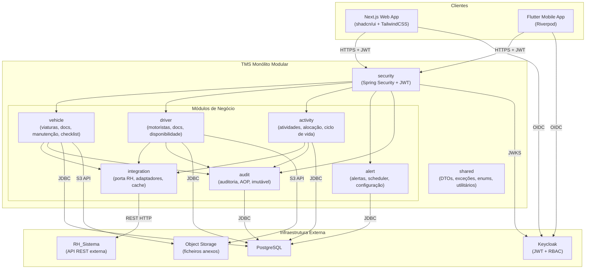
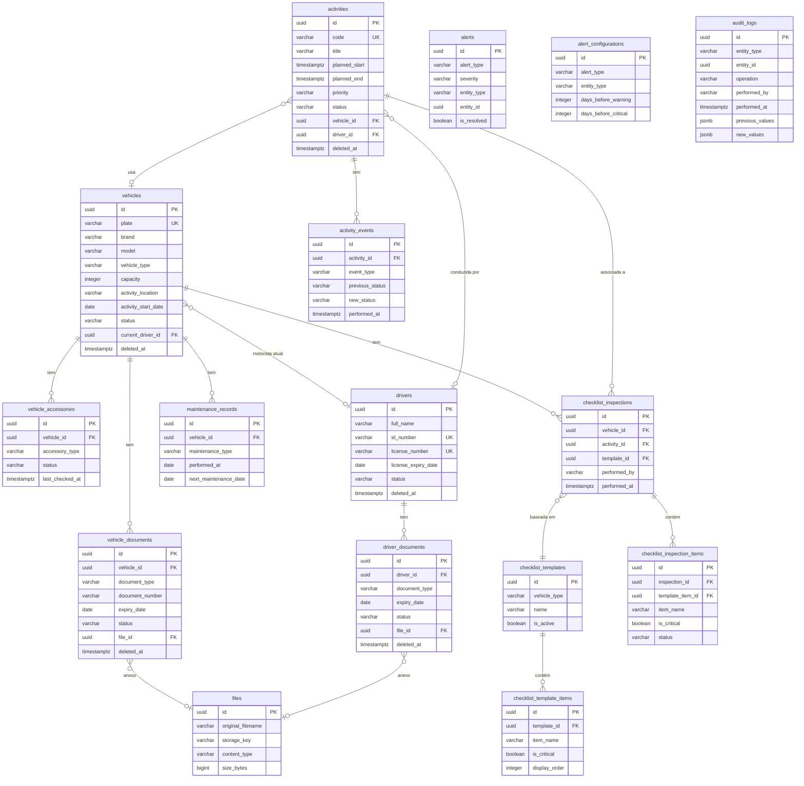
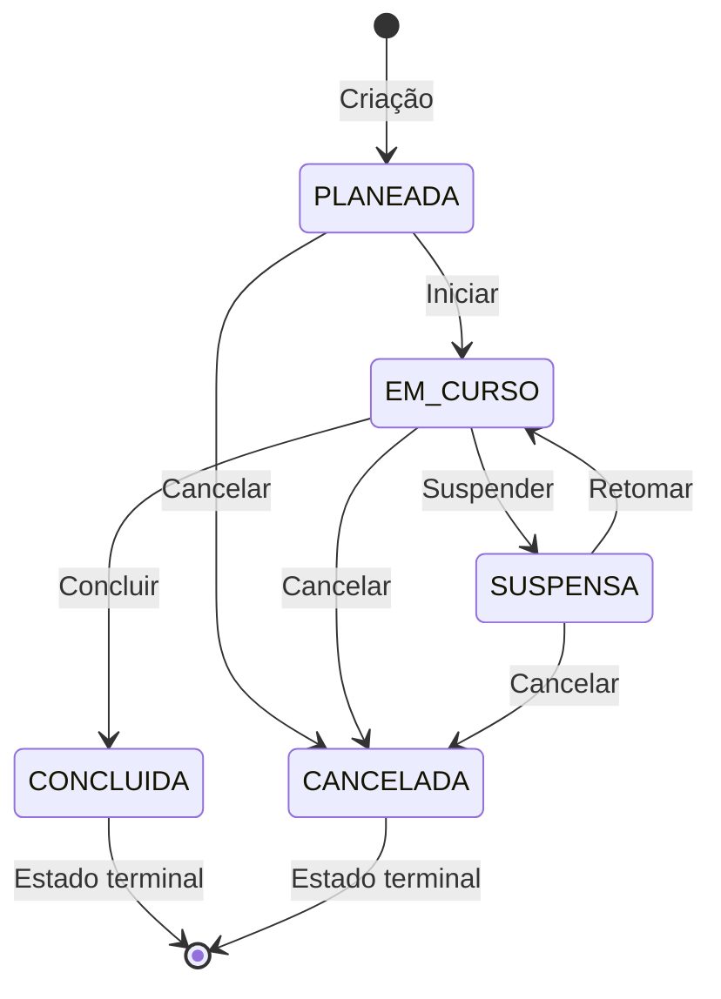

# Documento de Design Técnico — TMS

**Versão:** 1.0  
**Data:** 2025  
**Stack:** Java 21 · Spring Boot · Spring Modulith · PostgreSQL · Keycloak · Next.js · Flutter

---

## Índice

1. [Visão Geral da Arquitetura](#1-visão-geral-da-arquitetura)
2. [Módulos Spring Modulith](#2-módulos-spring-modulith)
3. [Modelo de Dados PostgreSQL](#3-modelo-de-dados-postgresql)
4. [Enums Java](#4-enums-java)
5. [Entidades JPA](#5-entidades-jpa)
6. [APIs REST — Endpoints Completos](#6-apis-rest--endpoints-completos)
7. [Motor de Validação de Alocação](#7-motor-de-validação-de-alocação)
8. [Máquina de Estados das Atividades](#8-máquina-de-estados-das-atividades)
9. [Sistema de Alertas](#9-sistema-de-alertas)
10. [Estratégia de Auditoria](#10-estratégia-de-auditoria)
11. [Integração com RH_Sistema](#11-integração-com-rh_sistema)
12. [Segurança](#12-segurança)
13. [Estrutura Completa de Pastas — Backend](#13-estrutura-completa-de-pastas--backend)
14. [Estrutura Frontend Next.js](#14-estrutura-frontend-nextjs)
15. [Estrutura App Flutter](#15-estrutura-app-flutter)
16. [Plano de Implementação por Fases](#16-plano-de-implementação-por-fases)

---

## 1. Visão Geral da Arquitetura

O TMS é um **monólito modular** construído com Spring Modulith. Toda a lógica de negócio reside num único processo JVM, organizado em módulos com fronteiras bem definidas. Não há microserviços, não há CQRS, não há event sourcing.

### 1.1 Diagrama de Arquitetura Geral



### 1.2 Camadas da Aplicação

| Camada                           | Responsabilidade                                           | Tecnologia                               |
| -------------------------------- | ---------------------------------------------------------- | ---------------------------------------- |
| **Apresentação**                 | Receber pedidos HTTP, validar input, serializar respostas  | Spring MVC, Jackson, Bean Validation     |
| **Serviço / Aplicação**          | Orquestrar lógica de negócio, transações, publicar eventos | Spring `@Service`, `@Transactional`      |
| **Domínio / Entidade**           | Representar o estado persistido, regras de integridade     | JPA `@Entity`, Lombok                    |
| **Repositório / Infraestrutura** | Acesso à base de dados, queries JPQL/nativas               | Spring Data JPA, `JpaRepository`         |
| **Integração**                   | Comunicação com sistemas externos (RH, Object Storage)     | RestTemplate / WebClient, Caffeine Cache |
| **Segurança**                    | Autenticação JWT, autorização RBAC, rate limiting          | Spring Security, Bucket4j                |
| **Auditoria**                    | Registo imutável de operações, AOP transversal             | Spring AOP, Spring Modulith Events       |

### 1.3 Princípios de Modularidade

- Cada módulo expõe apenas as suas interfaces públicas (serviços e DTOs). As entidades JPA são internas ao módulo.
- A comunicação entre módulos é feita por **chamada direta de serviço** quando é síncrona e obrigatória (ex.: validação de alocação), ou por **eventos Spring Modulith** quando é assíncrona e desacoplada (ex.: publicação de evento de auditoria).
- O módulo `shared` contém apenas código sem dependências de negócio: DTOs genéricos, enums, exceções, utilitários.
- O módulo `security` não tem dependências de negócio — apenas configura Spring Security e expõe `SecurityUtils`.

---

## 2. Módulos Spring Modulith

### 2.1 Módulo `vehicle`

**Responsabilidade:** Gestão completa do ciclo de vida das viaturas — cadastro, acessórios, documentação, manutenção e checklists de inspeção.

**Dependências permitidas:** `shared`, `integration` (para upload de ficheiros via Object Storage), `audit` (via evento).

**Comunicação:**

- Chama `AuditService` via evento Spring Modulith (`AuditEvent`) — nunca chamada direta.
- Chama `FileStoragePort` diretamente para upload/download de ficheiros.

**Estrutura de pacotes:**

```
vehicle/
  controller/
    VehicleController.java
    VehicleDocumentController.java
    MaintenanceController.java
    ChecklistController.java
  service/
    VehicleService.java
    VehicleDocumentService.java
    MaintenanceService.java
    ChecklistService.java
  repository/
    VehicleRepository.java
    VehicleDocumentRepository.java
    VehicleAccessoryRepository.java
    MaintenanceRepository.java
    ChecklistTemplateRepository.java
    ChecklistInspectionRepository.java
  entity/
    Vehicle.java
    VehicleDocument.java
    VehicleAccessory.java
    MaintenanceRecord.java
    ChecklistTemplate.java
    ChecklistTemplateItem.java
    ChecklistInspection.java
    ChecklistInspectionItem.java
  dto/
    VehicleCreateDto.java
    VehicleUpdateDto.java
    VehicleResponseDto.java
    VehicleConsolidatedDto.java
    VehicleDocumentDto.java
    VehicleAccessoryDto.java
    MaintenanceRecordDto.java
    ChecklistInspectionDto.java
    ChecklistTemplateDto.java
  mapper/
    VehicleMapper.java
    VehicleDocumentMapper.java
    MaintenanceMapper.java
    ChecklistMapper.java
  validation/
    VehicleValidator.java
    DocumentValidator.java
```

---

### 2.2 Módulo `driver`

**Responsabilidade:** Gestão de motoristas — cadastro, documentação, consulta de disponibilidade operacional via integração com RH.

**Dependências permitidas:** `shared`, `integration` (RH e Object Storage), `audit` (via evento).

**Comunicação:**

- Chama `RhIntegrationPort` diretamente (síncrono, necessário para validação de alocação).
- Publica `AuditEvent` via Spring Modulith Events.

**Estrutura de pacotes:**

```
driver/
  controller/
    DriverController.java
    DriverDocumentController.java
  service/
    DriverService.java
    DriverDocumentService.java
  repository/
    DriverRepository.java
    DriverDocumentRepository.java
  entity/
    Driver.java
    DriverDocument.java
  dto/
    DriverCreateDto.java
    DriverUpdateDto.java
    DriverResponseDto.java
    DriverDocumentDto.java
    DriverAvailabilityResponseDto.java
  mapper/
    DriverMapper.java
    DriverDocumentMapper.java
  validation/
    DriverValidator.java
```

---

### 2.3 Módulo `activity`

**Responsabilidade:** Ciclo de vida completo das atividades logísticas — criação, alocação de recursos, transições de estado, histórico de eventos.

**Dependências permitidas:** `shared`, `vehicle` (consulta de estado e documentos), `driver` (consulta de estado e disponibilidade), `integration` (RH), `audit` (via evento).

**Comunicação:**

- Chama `VehicleService` e `DriverService` diretamente para validação de alocação (síncrono, bloqueante).
- Chama `RhIntegrationPort` via `AllocationValidationService`.
- Publica `AuditEvent` via Spring Modulith Events.

**Estrutura de pacotes:**

```
activity/
  controller/
    ActivityController.java
  service/
    ActivityService.java
    AllocationValidationService.java
    ActivityCodeGenerator.java
  repository/
    ActivityRepository.java
    ActivityEventRepository.java
  entity/
    Activity.java
    ActivityEvent.java
  dto/
    ActivityCreateDto.java
    ActivityUpdateDto.java
    ActivityResponseDto.java
    AllocationRequestDto.java
    AllocationResultDto.java
    StatusTransitionDto.java
    ActivityEventDto.java
  mapper/
    ActivityMapper.java
```

---

### 2.4 Módulo `alert`

**Responsabilidade:** Geração automática de alertas por job agendado, gestão do ciclo de vida dos alertas, configuração de períodos de alerta por tipo.

**Dependências permitidas:** `shared`, `vehicle` (consulta de documentos e manutenções), `driver` (consulta de documentos).

**Comunicação:**

- Chama `VehicleDocumentRepository` e `DriverDocumentRepository` diretamente para verificar validades.
- Não publica eventos — é um consumidor de dados, não um produtor de eventos de negócio.

**Estrutura de pacotes:**

```
alert/
  controller/
    AlertController.java
    AlertConfigurationController.java
  service/
    AlertService.java
    AlertScheduler.java
    AlertResolutionService.java
  repository/
    AlertRepository.java
    AlertConfigurationRepository.java
  entity/
    Alert.java
    AlertConfiguration.java
  dto/
    AlertResponseDto.java
    AlertConfigurationDto.java
  mapper/
    AlertMapper.java
```

---

### 2.5 Módulo `audit`

**Responsabilidade:** Receção e persistência de eventos de auditoria, exposição de interface de consulta. Os registos são imutáveis.

**Dependências permitidas:** `shared` apenas.

**Comunicação:**

- Consome `AuditEvent` publicado pelos outros módulos via Spring Modulith Events (assíncrono, desacoplado).
- Nunca chama outros módulos.

**Estrutura de pacotes:**

```
audit/
  controller/
    AuditController.java
  service/
    AuditService.java
  repository/
    AuditLogRepository.java
  entity/
    AuditLog.java
  aspect/
    AuditAspect.java
  annotation/
    Auditable.java
  event/
    AuditEvent.java
  dto/
    AuditLogResponseDto.java
    AuditQueryDto.java
  mapper/
    AuditMapper.java
```

---

### 2.6 Módulo `integration`

**Responsabilidade:** Abstração da comunicação com sistemas externos — RH_Sistema e Object Storage. Expõe portas (interfaces) e adaptadores concretos.

**Dependências permitidas:** `shared` apenas.

**Comunicação:**

- Expõe `RhIntegrationPort` e `FileStoragePort` para consumo pelos outros módulos.
- Implementa adaptadores concretos: `RhRestAdapter`, `RhModuleAdapter`, `S3FileStorageAdapter`.

**Estrutura de pacotes:**

```
integration/
  port/
    RhIntegrationPort.java
    FileStoragePort.java
  adapter/
    RhRestAdapter.java
    RhModuleAdapter.java
    S3FileStorageAdapter.java
  config/
    RhIntegrationConfig.java
    FileStorageConfig.java
  dto/
    DriverAvailabilityDto.java
    RhAbsenceDto.java
    FileUploadResultDto.java
```

---

### 2.7 Módulo `shared`

**Responsabilidade:** Código partilhado sem lógica de negócio — DTOs genéricos, enums, exceções, utilitários, tratamento global de erros.

**Dependências permitidas:** Nenhuma dependência de outros módulos TMS.

**Estrutura de pacotes:**

```
shared/
  dto/
    ApiResponse.java
    PagedResponse.java
  exception/
    BusinessException.java
    AllocationException.java
    ResourceNotFoundException.java
    GlobalExceptionHandler.java
  util/
    DateUtils.java
    CodeGenerator.java
  enums/
    (todos os enums — ver Secção 4)
```

---

### 2.8 Módulo `security`

**Responsabilidade:** Configuração de Spring Security, validação de JWT Keycloak, mapeamento de roles, rate limiting.

**Dependências permitidas:** `shared` apenas.

**Estrutura de pacotes:**

```
security/
  config/
    SecurityConfig.java
    KeycloakConfig.java
  converter/
    KeycloakJwtAuthenticationConverter.java
  util/
    SecurityUtils.java
  ratelimit/
    RateLimitFilter.java
    RateLimitConfig.java
```

---

## 3. Modelo de Dados PostgreSQL

### 3.1 Convenções

- Todas as PKs são `UUID` geradas pela aplicação (`gen_random_uuid()` como default).
- Todas as tabelas têm `created_at TIMESTAMPTZ NOT NULL DEFAULT NOW()`, `updated_at TIMESTAMPTZ NOT NULL DEFAULT NOW()`, `created_by VARCHAR(100) NOT NULL`, `updated_by VARCHAR(100) NOT NULL`.
- Entidades principais têm `deleted_at TIMESTAMPTZ` e `deleted_by VARCHAR(100)` para soft delete.
- Enums são armazenados como `VARCHAR` com `CHECK` constraint.
- Timestamps são sempre `TIMESTAMPTZ` (com fuso horário).

---

### 3.2 Tabela `vehicles`

```sql
CREATE TABLE vehicles (
    id                  UUID PRIMARY KEY DEFAULT gen_random_uuid(),
    plate               VARCHAR(20)  NOT NULL UNIQUE,
    brand               VARCHAR(100) NOT NULL,
    model               VARCHAR(100) NOT NULL,
    vehicle_type        VARCHAR(100) NOT NULL,
    capacity            INTEGER      NOT NULL,
    activity_location   VARCHAR(200) NOT NULL,
    activity_start_date DATE         NOT NULL,
    status              VARCHAR(30)  NOT NULL DEFAULT 'DISPONIVEL'
                            CHECK (status IN ('DISPONIVEL','INDISPONIVEL','EM_MANUTENCAO','ABATIDA')),
    current_driver_id   UUID         REFERENCES drivers(id) ON DELETE SET NULL,
    notes               TEXT,
    created_at          TIMESTAMPTZ  NOT NULL DEFAULT NOW(),
    updated_at          TIMESTAMPTZ  NOT NULL DEFAULT NOW(),
    created_by          VARCHAR(100) NOT NULL,
    updated_by          VARCHAR(100) NOT NULL,
    deleted_at          TIMESTAMPTZ,
    deleted_by          VARCHAR(100)
);

CREATE INDEX idx_vehicles_plate        ON vehicles(plate);
CREATE INDEX idx_vehicles_status       ON vehicles(status) WHERE deleted_at IS NULL;
CREATE INDEX idx_vehicles_location     ON vehicles(activity_location) WHERE deleted_at IS NULL;
CREATE INDEX idx_vehicles_plate_trgm   ON vehicles USING gin(plate gin_trgm_ops);
```

---

### 3.3 Tabela `vehicle_accessories`

```sql
CREATE TABLE vehicle_accessories (
    id               UUID PRIMARY KEY DEFAULT gen_random_uuid(),
    vehicle_id       UUID         NOT NULL REFERENCES vehicles(id) ON DELETE CASCADE,
    accessory_type   VARCHAR(50)  NOT NULL
                         CHECK (accessory_type IN ('MACACO','RODA_SOBRESSALENTE','TRIANGULO',
                                                   'EXTINTOR','KIT_PRIMEIROS_SOCORROS',
                                                   'COLETE_REFLETOR','OUTRO')),
    status           VARCHAR(20)  NOT NULL DEFAULT 'PRESENTE'
                         CHECK (status IN ('PRESENTE','AUSENTE','DANIFICADO')),
    last_checked_at  TIMESTAMPTZ,
    last_checked_by  VARCHAR(100),
    notes            TEXT,
    created_at       TIMESTAMPTZ  NOT NULL DEFAULT NOW(),
    updated_at       TIMESTAMPTZ  NOT NULL DEFAULT NOW(),
    created_by       VARCHAR(100) NOT NULL,
    updated_by       VARCHAR(100) NOT NULL,
    UNIQUE (vehicle_id, accessory_type)
);

CREATE INDEX idx_vehicle_accessories_vehicle ON vehicle_accessories(vehicle_id);
```

---

### 3.4 Tabela `vehicle_documents`

```sql
CREATE TABLE vehicle_documents (
    id               UUID PRIMARY KEY DEFAULT gen_random_uuid(),
    vehicle_id       UUID         NOT NULL REFERENCES vehicles(id) ON DELETE CASCADE,
    document_type    VARCHAR(30)  NOT NULL
                         CHECK (document_type IN ('LIVRETE','INSPECAO','SEGURO',
                                                  'LICENCA','MANIFESTO','TAXA_RADIO','OUTRO')),
    document_number  VARCHAR(100),
    issue_date       DATE,
    expiry_date      DATE,
    issuing_entity   VARCHAR(200),
    status           VARCHAR(30)  NOT NULL DEFAULT 'VALIDO'
                         CHECK (status IN ('VALIDO','EXPIRADO','PENDENTE_RENOVACAO','CANCELADO')),
    notes            TEXT,
    file_id          UUID         REFERENCES files(id) ON DELETE SET NULL,
    created_at       TIMESTAMPTZ  NOT NULL DEFAULT NOW(),
    updated_at       TIMESTAMPTZ  NOT NULL DEFAULT NOW(),
    created_by       VARCHAR(100) NOT NULL,
    updated_by       VARCHAR(100) NOT NULL,
    deleted_at       TIMESTAMPTZ,
    deleted_by       VARCHAR(100)
);

CREATE INDEX idx_vehicle_docs_vehicle     ON vehicle_documents(vehicle_id) WHERE deleted_at IS NULL;
CREATE INDEX idx_vehicle_docs_expiry      ON vehicle_documents(expiry_date) WHERE deleted_at IS NULL AND status != 'CANCELADO';
CREATE INDEX idx_vehicle_docs_status      ON vehicle_documents(status) WHERE deleted_at IS NULL;
```

---

### 3.5 Tabela `drivers`

```sql
CREATE TABLE drivers (
    id                   UUID PRIMARY KEY DEFAULT gen_random_uuid(),
    full_name            VARCHAR(200) NOT NULL,
    phone                VARCHAR(30)  NOT NULL,
    address              TEXT         NOT NULL,
    id_number            VARCHAR(50)  NOT NULL UNIQUE,
    license_number       VARCHAR(50)  NOT NULL UNIQUE,
    license_category     VARCHAR(20)  NOT NULL,
    license_issue_date   DATE         NOT NULL,
    license_expiry_date  DATE         NOT NULL,
    activity_location    VARCHAR(200) NOT NULL,
    status               VARCHAR(20)  NOT NULL DEFAULT 'ATIVO'
                             CHECK (status IN ('ATIVO','INATIVO','SUSPENSO')),
    notes                TEXT,
    created_at           TIMESTAMPTZ  NOT NULL DEFAULT NOW(),
    updated_at           TIMESTAMPTZ  NOT NULL DEFAULT NOW(),
    created_by           VARCHAR(100) NOT NULL,
    updated_by           VARCHAR(100) NOT NULL,
    deleted_at           TIMESTAMPTZ,
    deleted_by           VARCHAR(100)
);

CREATE INDEX idx_drivers_status        ON drivers(status) WHERE deleted_at IS NULL;
CREATE INDEX idx_drivers_license_expiry ON drivers(license_expiry_date) WHERE deleted_at IS NULL;
CREATE INDEX idx_drivers_location      ON drivers(activity_location) WHERE deleted_at IS NULL;
```

---

### 3.6 Tabela `driver_documents`

```sql
CREATE TABLE driver_documents (
    id               UUID PRIMARY KEY DEFAULT gen_random_uuid(),
    driver_id        UUID         NOT NULL REFERENCES drivers(id) ON DELETE CASCADE,
    document_type    VARCHAR(30)  NOT NULL
                         CHECK (document_type IN ('CARTA_CONDUCAO','BILHETE_IDENTIDADE','OUTRO')),
    document_number  VARCHAR(100),
    issue_date       DATE,
    expiry_date      DATE,
    issuing_entity   VARCHAR(200),
    category         VARCHAR(20),
    status           VARCHAR(30)  NOT NULL DEFAULT 'VALIDO'
                         CHECK (status IN ('VALIDO','EXPIRADO','PENDENTE_RENOVACAO','CANCELADO')),
    notes            TEXT,
    file_id          UUID         REFERENCES files(id) ON DELETE SET NULL,
    created_at       TIMESTAMPTZ  NOT NULL DEFAULT NOW(),
    updated_at       TIMESTAMPTZ  NOT NULL DEFAULT NOW(),
    created_by       VARCHAR(100) NOT NULL,
    updated_by       VARCHAR(100) NOT NULL,
    deleted_at       TIMESTAMPTZ,
    deleted_by       VARCHAR(100)
);

CREATE INDEX idx_driver_docs_driver  ON driver_documents(driver_id) WHERE deleted_at IS NULL;
CREATE INDEX idx_driver_docs_expiry  ON driver_documents(expiry_date) WHERE deleted_at IS NULL AND status != 'CANCELADO';
```

---

### 3.7 Tabela `maintenance_records`

```sql
CREATE TABLE maintenance_records (
    id                       UUID PRIMARY KEY DEFAULT gen_random_uuid(),
    vehicle_id               UUID           NOT NULL REFERENCES vehicles(id) ON DELETE CASCADE,
    maintenance_type         VARCHAR(20)    NOT NULL
                                 CHECK (maintenance_type IN ('PREVENTIVA','CORRETIVA')),
    performed_at             DATE           NOT NULL,
    mileage_at_service       INTEGER,
    description              TEXT           NOT NULL,
    supplier                 VARCHAR(200),
    total_cost               NUMERIC(10,2),
    parts_replaced           TEXT,
    next_maintenance_date    DATE,
    next_maintenance_mileage INTEGER,
    responsible_user         VARCHAR(100)   NOT NULL,
    created_at               TIMESTAMPTZ    NOT NULL DEFAULT NOW(),
    updated_at               TIMESTAMPTZ    NOT NULL DEFAULT NOW(),
    created_by               VARCHAR(100)   NOT NULL,
    updated_by               VARCHAR(100)   NOT NULL
);

CREATE INDEX idx_maintenance_vehicle      ON maintenance_records(vehicle_id);
CREATE INDEX idx_maintenance_performed_at ON maintenance_records(performed_at);
CREATE INDEX idx_maintenance_next_date    ON maintenance_records(next_maintenance_date) WHERE next_maintenance_date IS NOT NULL;
```

---

### 3.8 Tabelas `checklist_templates` e `checklist_template_items`

```sql
CREATE TABLE checklist_templates (
    id           UUID PRIMARY KEY DEFAULT gen_random_uuid(),
    vehicle_type VARCHAR(100) NOT NULL,
    name         VARCHAR(200) NOT NULL,
    is_active    BOOLEAN      NOT NULL DEFAULT TRUE,
    created_at   TIMESTAMPTZ  NOT NULL DEFAULT NOW(),
    updated_at   TIMESTAMPTZ  NOT NULL DEFAULT NOW(),
    created_by   VARCHAR(100) NOT NULL,
    updated_by   VARCHAR(100) NOT NULL
);

CREATE TABLE checklist_template_items (
    id            UUID PRIMARY KEY DEFAULT gen_random_uuid(),
    template_id   UUID         NOT NULL REFERENCES checklist_templates(id) ON DELETE CASCADE,
    item_name     VARCHAR(200) NOT NULL,
    is_critical   BOOLEAN      NOT NULL DEFAULT FALSE,
    display_order INTEGER      NOT NULL DEFAULT 0,
    created_at    TIMESTAMPTZ  NOT NULL DEFAULT NOW(),
    updated_at    TIMESTAMPTZ  NOT NULL DEFAULT NOW(),
    created_by    VARCHAR(100) NOT NULL,
    updated_by    VARCHAR(100) NOT NULL
);

CREATE INDEX idx_checklist_template_items_template ON checklist_template_items(template_id);
```

---

### 3.9 Tabelas `checklist_inspections` e `checklist_inspection_items`

```sql
CREATE TABLE checklist_inspections (
    id           UUID PRIMARY KEY DEFAULT gen_random_uuid(),
    vehicle_id   UUID         NOT NULL REFERENCES vehicles(id) ON DELETE CASCADE,
    activity_id  UUID         REFERENCES activities(id) ON DELETE SET NULL,
    template_id  UUID         NOT NULL REFERENCES checklist_templates(id),
    performed_by VARCHAR(100) NOT NULL,
    performed_at TIMESTAMPTZ  NOT NULL,
    notes        TEXT,
    created_at   TIMESTAMPTZ  NOT NULL DEFAULT NOW(),
    updated_at   TIMESTAMPTZ  NOT NULL DEFAULT NOW(),
    created_by   VARCHAR(100) NOT NULL,
    updated_by   VARCHAR(100) NOT NULL
);

CREATE TABLE checklist_inspection_items (
    id               UUID PRIMARY KEY DEFAULT gen_random_uuid(),
    inspection_id    UUID         NOT NULL REFERENCES checklist_inspections(id) ON DELETE CASCADE,
    template_item_id UUID         REFERENCES checklist_template_items(id) ON DELETE SET NULL,
    item_name        VARCHAR(200) NOT NULL,
    is_critical      BOOLEAN      NOT NULL DEFAULT FALSE,
    status           VARCHAR(20)  NOT NULL
                         CHECK (status IN ('OK','AVARIA','FALTA')),
    notes            TEXT,
    created_at       TIMESTAMPTZ  NOT NULL DEFAULT NOW(),
    updated_by       VARCHAR(100) NOT NULL
);

CREATE INDEX idx_checklist_inspections_vehicle   ON checklist_inspections(vehicle_id);
CREATE INDEX idx_checklist_inspections_activity  ON checklist_inspections(activity_id);
CREATE INDEX idx_checklist_inspection_items_insp ON checklist_inspection_items(inspection_id);
```

---

### 3.10 Tabela `activities`

```sql
CREATE TABLE activities (
    id                          UUID PRIMARY KEY DEFAULT gen_random_uuid(),
    code                        VARCHAR(30)  NOT NULL UNIQUE,
    title                       VARCHAR(300) NOT NULL,
    activity_type               VARCHAR(100) NOT NULL,
    location                    VARCHAR(300) NOT NULL,
    planned_start               TIMESTAMPTZ  NOT NULL,
    planned_end                 TIMESTAMPTZ  NOT NULL,
    actual_start                TIMESTAMPTZ,
    actual_end                  TIMESTAMPTZ,
    priority                    VARCHAR(20)  NOT NULL DEFAULT 'NORMAL'
                                    CHECK (priority IN ('BAIXA','NORMAL','ALTA','URGENTE')),
    status                      VARCHAR(20)  NOT NULL DEFAULT 'PLANEADA'
                                    CHECK (status IN ('PLANEADA','EM_CURSO','SUSPENSA','CONCLUIDA','CANCELADA')),
    vehicle_id                  UUID         REFERENCES vehicles(id) ON DELETE SET NULL,
    driver_id                   UUID         REFERENCES drivers(id) ON DELETE SET NULL,
    description                 TEXT,
    notes                       TEXT,
    rh_override_justification   TEXT,
    created_at                  TIMESTAMPTZ  NOT NULL DEFAULT NOW(),
    updated_at                  TIMESTAMPTZ  NOT NULL DEFAULT NOW(),
    created_by                  VARCHAR(100) NOT NULL,
    updated_by                  VARCHAR(100) NOT NULL,
    deleted_at                  TIMESTAMPTZ,
    deleted_by                  VARCHAR(100)
);

CREATE INDEX idx_activities_status       ON activities(status) WHERE deleted_at IS NULL;
CREATE INDEX idx_activities_vehicle      ON activities(vehicle_id) WHERE deleted_at IS NULL;
CREATE INDEX idx_activities_driver       ON activities(driver_id) WHERE deleted_at IS NULL;
CREATE INDEX idx_activities_planned_start ON activities(planned_start) WHERE deleted_at IS NULL;
CREATE INDEX idx_activities_code         ON activities(code);
```

---

### 3.11 Tabela `activity_events`

```sql
CREATE TABLE activity_events (
    id               UUID PRIMARY KEY DEFAULT gen_random_uuid(),
    activity_id      UUID         NOT NULL REFERENCES activities(id) ON DELETE CASCADE,
    event_type       VARCHAR(50)  NOT NULL,
    previous_status  VARCHAR(20),
    new_status       VARCHAR(20),
    performed_by     VARCHAR(100) NOT NULL,
    performed_at     TIMESTAMPTZ  NOT NULL DEFAULT NOW(),
    notes            TEXT,
    created_at       TIMESTAMPTZ  NOT NULL DEFAULT NOW(),
    created_by       VARCHAR(100) NOT NULL
);

CREATE INDEX idx_activity_events_activity ON activity_events(activity_id);
```

---

### 3.12 Tabelas `alerts` e `alert_configurations`

```sql
CREATE TABLE alerts (
    id           UUID PRIMARY KEY DEFAULT gen_random_uuid(),
    alert_type   VARCHAR(50)  NOT NULL
                     CHECK (alert_type IN ('DOCUMENT_EXPIRING','DOCUMENT_EXPIRED',
                                           'MAINTENANCE_DUE','MAINTENANCE_OVERDUE',
                                           'CHECKLIST_FAILURE')),
    severity     VARCHAR(20)  NOT NULL
                     CHECK (severity IN ('INFO','AVISO','CRITICO')),
    entity_type  VARCHAR(50)  NOT NULL,
    entity_id    UUID         NOT NULL,
    title        VARCHAR(300) NOT NULL,
    message      TEXT         NOT NULL,
    is_resolved  BOOLEAN      NOT NULL DEFAULT FALSE,
    resolved_at  TIMESTAMPTZ,
    resolved_by  VARCHAR(100),
    created_at   TIMESTAMPTZ  NOT NULL DEFAULT NOW(),
    updated_at   TIMESTAMPTZ  NOT NULL DEFAULT NOW(),
    created_by   VARCHAR(100) NOT NULL,
    updated_by   VARCHAR(100) NOT NULL
);

CREATE INDEX idx_alerts_entity       ON alerts(entity_type, entity_id);
CREATE INDEX idx_alerts_is_resolved  ON alerts(is_resolved) WHERE is_resolved = FALSE;
CREATE INDEX idx_alerts_severity     ON alerts(severity) WHERE is_resolved = FALSE;
CREATE UNIQUE INDEX idx_alerts_dedup ON alerts(alert_type, entity_id) WHERE is_resolved = FALSE;

CREATE TABLE alert_configurations (
    id                  UUID PRIMARY KEY DEFAULT gen_random_uuid(),
    alert_type          VARCHAR(50)  NOT NULL,
    entity_type         VARCHAR(50)  NOT NULL,
    days_before_warning INTEGER      NOT NULL DEFAULT 30,
    days_before_critical INTEGER     NOT NULL DEFAULT 7,
    is_active           BOOLEAN      NOT NULL DEFAULT TRUE,
    created_at          TIMESTAMPTZ  NOT NULL DEFAULT NOW(),
    updated_at          TIMESTAMPTZ  NOT NULL DEFAULT NOW(),
    created_by          VARCHAR(100) NOT NULL,
    updated_by          VARCHAR(100) NOT NULL,
    UNIQUE (alert_type, entity_type)
);
```

---

### 3.13 Tabela `audit_logs`

```sql
CREATE TABLE audit_logs (
    id               UUID PRIMARY KEY DEFAULT gen_random_uuid(),
    entity_type      VARCHAR(100) NOT NULL,
    entity_id        UUID         NOT NULL,
    operation        VARCHAR(20)  NOT NULL
                         CHECK (operation IN ('CRIACAO','ATUALIZACAO','ELIMINACAO')),
    performed_by     VARCHAR(100) NOT NULL,
    performed_at     TIMESTAMPTZ  NOT NULL DEFAULT NOW(),
    ip_address       VARCHAR(45),
    previous_values  JSONB,
    new_values       JSONB,
    created_at       TIMESTAMPTZ  NOT NULL DEFAULT NOW()
    -- SEM updated_at, SEM deleted_at — registo imutável
);

CREATE INDEX idx_audit_entity      ON audit_logs(entity_type, entity_id);
CREATE INDEX idx_audit_performed_by ON audit_logs(performed_by);
CREATE INDEX idx_audit_performed_at ON audit_logs(performed_at);
CREATE INDEX idx_audit_operation   ON audit_logs(operation);
```

---

### 3.14 Tabela `files`

```sql
CREATE TABLE files (
    id                UUID PRIMARY KEY DEFAULT gen_random_uuid(),
    original_filename VARCHAR(500) NOT NULL,
    storage_key       VARCHAR(500) NOT NULL UNIQUE,
    content_type      VARCHAR(100) NOT NULL,
    size_bytes        BIGINT       NOT NULL,
    uploaded_by       VARCHAR(100) NOT NULL,
    uploaded_at       TIMESTAMPTZ  NOT NULL DEFAULT NOW(),
    created_at        TIMESTAMPTZ  NOT NULL DEFAULT NOW()
);
```

---

### 3.15 Diagrama ERD



---

## 4. Enums Java

Todos os enums residem no pacote `pt.company.tms.shared.enums`.

```java
// VehicleStatus.java
public enum VehicleStatus {
    DISPONIVEL,
    INDISPONIVEL,
    EM_MANUTENCAO,
    ABATIDA
}

// DriverStatus.java
public enum DriverStatus {
    ATIVO,
    INATIVO,
    SUSPENSO
}

// ActivityStatus.java
public enum ActivityStatus {
    PLANEADA,
    EM_CURSO,
    SUSPENSA,
    CONCLUIDA,
    CANCELADA
}

// ActivityPriority.java
public enum ActivityPriority {
    BAIXA,
    NORMAL,
    ALTA,
    URGENTE
}

// DocumentStatus.java
public enum DocumentStatus {
    VALIDO,
    EXPIRADO,
    PENDENTE_RENOVACAO,
    CANCELADO
}

// VehicleDocumentType.java
public enum VehicleDocumentType {
    LIVRETE,
    INSPECAO,
    SEGURO,
    LICENCA,
    MANIFESTO,
    TAXA_RADIO,
    OUTRO
}

// DriverDocumentType.java
public enum DriverDocumentType {
    CARTA_CONDUCAO,
    BILHETE_IDENTIDADE,
    OUTRO
}

// MaintenanceType.java
public enum MaintenanceType {
    PREVENTIVA,
    CORRETIVA
}

// ChecklistItemStatus.java
public enum ChecklistItemStatus {
    OK,
    AVARIA,
    FALTA
}

// AccessoryStatus.java
public enum AccessoryStatus {
    PRESENTE,
    AUSENTE,
    DANIFICADO
}

// AccessoryType.java
public enum AccessoryType {
    MACACO,
    RODA_SOBRESSALENTE,
    TRIANGULO,
    EXTINTOR,
    KIT_PRIMEIROS_SOCORROS,
    COLETE_REFLETOR,
    OUTRO
}

// AlertSeverity.java
public enum AlertSeverity {
    INFO,
    AVISO,
    CRITICO
}

// AlertType.java
public enum AlertType {
    DOCUMENT_EXPIRING,
    DOCUMENT_EXPIRED,
    MAINTENANCE_DUE,
    MAINTENANCE_OVERDUE,
    CHECKLIST_FAILURE
}

// AuditOperation.java
public enum AuditOperation {
    CRIACAO,
    ATUALIZACAO,
    ELIMINACAO
}
```

---

## 5. Entidades JPA

### 5.1 Vehicle

```java
@Entity
@Table(name = "vehicles")
@SQLRestriction("deleted_at IS NULL")
@EntityListeners(AuditingEntityListener.class)
@Getter @Setter @Builder @NoArgsConstructor @AllArgsConstructor
public class Vehicle {

    @Id
    @GeneratedValue(strategy = GenerationType.UUID)
    private UUID id;

    @Column(nullable = false, unique = true, length = 20)
    private String plate;

    @Column(nullable = false, length = 100)
    private String brand;

    @Column(nullable = false, length = 100)
    private String model;

    @Column(name = "vehicle_type", nullable = false, length = 100)
    private String vehicleType;

    @Column(nullable = false)
    private Integer capacity;

    @Column(name = "activity_location", nullable = false, length = 200)
    private String activityLocation;

    @Column(name = "activity_start_date", nullable = false)
    private LocalDate activityStartDate;

    @Enumerated(EnumType.STRING)
    @Column(nullable = false, length = 30)
    private VehicleStatus status = VehicleStatus.DISPONIVEL;

    @ManyToOne(fetch = FetchType.LAZY)
    @JoinColumn(name = "current_driver_id")
    private Driver currentDriver;

    @Column(columnDefinition = "TEXT")
    private String notes;

    @OneToMany(mappedBy = "vehicle", cascade = CascadeType.ALL, orphanRemoval = true)
    private List<VehicleDocument> documents = new ArrayList<>();

    @OneToMany(mappedBy = "vehicle", cascade = CascadeType.ALL, orphanRemoval = true)
    private List<VehicleAccessory> accessories = new ArrayList<>();

    @OneToMany(mappedBy = "vehicle", cascade = CascadeType.ALL)
    private List<MaintenanceRecord> maintenanceRecords = new ArrayList<>();

    @CreatedDate
    @Column(name = "created_at", nullable = false, updatable = false)
    private OffsetDateTime createdAt;

    @LastModifiedDate
    @Column(name = "updated_at", nullable = false)
    private OffsetDateTime updatedAt;

    @CreatedBy
    @Column(name = "created_by", nullable = false, updatable = false, length = 100)
    private String createdBy;

    @LastModifiedBy
    @Column(name = "updated_by", nullable = false, length = 100)
    private String updatedBy;

    @Column(name = "deleted_at")
    private OffsetDateTime deletedAt;

    @Column(name = "deleted_by", length = 100)
    private String deletedBy;

    public void softDelete(String deletedBy) {
        this.deletedAt = OffsetDateTime.now();
        this.deletedBy = deletedBy;
    }
}
```

### 5.2 Driver

```java
@Entity
@Table(name = "drivers")
@SQLRestriction("deleted_at IS NULL")
@EntityListeners(AuditingEntityListener.class)
@Getter @Setter @Builder @NoArgsConstructor @AllArgsConstructor
public class Driver {

    @Id
    @GeneratedValue(strategy = GenerationType.UUID)
    private UUID id;

    @Column(name = "full_name", nullable = false, length = 200)
    private String fullName;

    @Column(nullable = false, length = 30)
    private String phone;

    @Column(nullable = false, columnDefinition = "TEXT")
    private String address;

    @Column(name = "id_number", nullable = false, unique = true, length = 50)
    private String idNumber;

    @Column(name = "license_number", nullable = false, unique = true, length = 50)
    private String licenseNumber;

    @Column(name = "license_category", nullable = false, length = 20)
    private String licenseCategory;

    @Column(name = "license_issue_date", nullable = false)
    private LocalDate licenseIssueDate;

    @Column(name = "license_expiry_date", nullable = false)
    private LocalDate licenseExpiryDate;

    @Column(name = "activity_location", nullable = false, length = 200)
    private String activityLocation;

    @Enumerated(EnumType.STRING)
    @Column(nullable = false, length = 20)
    private DriverStatus status = DriverStatus.ATIVO;

    @Column(columnDefinition = "TEXT")
    private String notes;

    @OneToMany(mappedBy = "driver", cascade = CascadeType.ALL, orphanRemoval = true)
    private List<DriverDocument> documents = new ArrayList<>();

    @CreatedDate
    @Column(name = "created_at", nullable = false, updatable = false)
    private OffsetDateTime createdAt;

    @LastModifiedDate
    @Column(name = "updated_at", nullable = false)
    private OffsetDateTime updatedAt;

    @CreatedBy
    @Column(name = "created_by", nullable = false, updatable = false, length = 100)
    private String createdBy;

    @LastModifiedBy
    @Column(name = "updated_by", nullable = false, length = 100)
    private String updatedBy;

    @Column(name = "deleted_at")
    private OffsetDateTime deletedAt;

    @Column(name = "deleted_by", length = 100)
    private String deletedBy;

    public void softDelete(String deletedBy) {
        this.deletedAt = OffsetDateTime.now();
        this.deletedBy = deletedBy;
    }
}
```

### 5.3 Activity

```java
@Entity
@Table(name = "activities")
@SQLRestriction("deleted_at IS NULL")
@EntityListeners(AuditingEntityListener.class)
@Getter @Setter @Builder @NoArgsConstructor @AllArgsConstructor
public class Activity {

    @Id
    @GeneratedValue(strategy = GenerationType.UUID)
    private UUID id;

    @Column(nullable = false, unique = true, length = 30)
    private String code;

    @Column(nullable = false, length = 300)
    private String title;

    @Column(name = "activity_type", nullable = false, length = 100)
    private String activityType;

    @Column(nullable = false, length = 300)
    private String location;

    @Column(name = "planned_start", nullable = false)
    private OffsetDateTime plannedStart;

    @Column(name = "planned_end", nullable = false)
    private OffsetDateTime plannedEnd;

    @Column(name = "actual_start")
    private OffsetDateTime actualStart;

    @Column(name = "actual_end")
    private OffsetDateTime actualEnd;

    @Enumerated(EnumType.STRING)
    @Column(nullable = false, length = 20)
    private ActivityPriority priority = ActivityPriority.NORMAL;

    @Enumerated(EnumType.STRING)
    @Column(nullable = false, length = 20)
    private ActivityStatus status = ActivityStatus.PLANEADA;

    @ManyToOne(fetch = FetchType.LAZY)
    @JoinColumn(name = "vehicle_id")
    private Vehicle vehicle;

    @ManyToOne(fetch = FetchType.LAZY)
    @JoinColumn(name = "driver_id")
    private Driver driver;

    @Column(columnDefinition = "TEXT")
    private String description;

    @Column(columnDefinition = "TEXT")
    private String notes;

    @Column(name = "rh_override_justification", columnDefinition = "TEXT")
    private String rhOverrideJustification;

    @OneToMany(mappedBy = "activity", cascade = CascadeType.ALL)
    @OrderBy("performedAt ASC")
    private List<ActivityEvent> events = new ArrayList<>();

    @CreatedDate
    @Column(name = "created_at", nullable = false, updatable = false)
    private OffsetDateTime createdAt;

    @LastModifiedDate
    @Column(name = "updated_at", nullable = false)
    private OffsetDateTime updatedAt;

    @CreatedBy
    @Column(name = "created_by", nullable = false, updatable = false, length = 100)
    private String createdBy;

    @LastModifiedBy
    @Column(name = "updated_by", nullable = false, length = 100)
    private String updatedBy;

    @Column(name = "deleted_at")
    private OffsetDateTime deletedAt;

    @Column(name = "deleted_by", length = 100)
    private String deletedBy;
}
```

### 5.4 VehicleDocument

```java
@Entity
@Table(name = "vehicle_documents")
@SQLRestriction("deleted_at IS NULL")
@EntityListeners(AuditingEntityListener.class)
@Getter @Setter @Builder @NoArgsConstructor @AllArgsConstructor
public class VehicleDocument {

    @Id
    @GeneratedValue(strategy = GenerationType.UUID)
    private UUID id;

    @ManyToOne(fetch = FetchType.LAZY)
    @JoinColumn(name = "vehicle_id", nullable = false)
    private Vehicle vehicle;

    @Enumerated(EnumType.STRING)
    @Column(name = "document_type", nullable = false, length = 30)
    private VehicleDocumentType documentType;

    @Column(name = "document_number", length = 100)
    private String documentNumber;

    @Column(name = "issue_date")
    private LocalDate issueDate;

    @Column(name = "expiry_date")
    private LocalDate expiryDate;

    @Column(name = "issuing_entity", length = 200)
    private String issuingEntity;

    @Enumerated(EnumType.STRING)
    @Column(nullable = false, length = 30)
    private DocumentStatus status = DocumentStatus.VALIDO;

    @Column(columnDefinition = "TEXT")
    private String notes;

    @ManyToOne(fetch = FetchType.LAZY)
    @JoinColumn(name = "file_id")
    private FileRecord fileRecord;

    @CreatedDate
    @Column(name = "created_at", nullable = false, updatable = false)
    private OffsetDateTime createdAt;

    @LastModifiedDate
    @Column(name = "updated_at", nullable = false)
    private OffsetDateTime updatedAt;

    @CreatedBy
    @Column(name = "created_by", nullable = false, updatable = false, length = 100)
    private String createdBy;

    @LastModifiedBy
    @Column(name = "updated_by", nullable = false, length = 100)
    private String updatedBy;

    @Column(name = "deleted_at")
    private OffsetDateTime deletedAt;

    @Column(name = "deleted_by", length = 100)
    private String deletedBy;
}
```

### 5.5 MaintenanceRecord

```java
@Entity
@Table(name = "maintenance_records")
@EntityListeners(AuditingEntityListener.class)
@Getter @Setter @Builder @NoArgsConstructor @AllArgsConstructor
public class MaintenanceRecord {

    @Id
    @GeneratedValue(strategy = GenerationType.UUID)
    private UUID id;

    @ManyToOne(fetch = FetchType.LAZY)
    @JoinColumn(name = "vehicle_id", nullable = false)
    private Vehicle vehicle;

    @Enumerated(EnumType.STRING)
    @Column(name = "maintenance_type", nullable = false, length = 20)
    private MaintenanceType maintenanceType;

    @Column(name = "performed_at", nullable = false)
    private LocalDate performedAt;

    @Column(name = "mileage_at_service")
    private Integer mileageAtService;

    @Column(nullable = false, columnDefinition = "TEXT")
    private String description;

    @Column(length = 200)
    private String supplier;

    @Column(name = "total_cost", precision = 10, scale = 2)
    private BigDecimal totalCost;

    @Column(name = "parts_replaced", columnDefinition = "TEXT")
    private String partsReplaced;

    @Column(name = "next_maintenance_date")
    private LocalDate nextMaintenanceDate;

    @Column(name = "next_maintenance_mileage")
    private Integer nextMaintenanceMileage;

    @Column(name = "responsible_user", nullable = false, length = 100)
    private String responsibleUser;

    @CreatedDate
    @Column(name = "created_at", nullable = false, updatable = false)
    private OffsetDateTime createdAt;

    @LastModifiedDate
    @Column(name = "updated_at", nullable = false)
    private OffsetDateTime updatedAt;

    @CreatedBy
    @Column(name = "created_by", nullable = false, updatable = false, length = 100)
    private String createdBy;

    @LastModifiedBy
    @Column(name = "updated_by", nullable = false, length = 100)
    private String updatedBy;
}
```

### 5.6 ChecklistInspection

```java
@Entity
@Table(name = "checklist_inspections")
@EntityListeners(AuditingEntityListener.class)
@Getter @Setter @Builder @NoArgsConstructor @AllArgsConstructor
public class ChecklistInspection {

    @Id
    @GeneratedValue(strategy = GenerationType.UUID)
    private UUID id;

    @ManyToOne(fetch = FetchType.LAZY)
    @JoinColumn(name = "vehicle_id", nullable = false)
    private Vehicle vehicle;

    @ManyToOne(fetch = FetchType.LAZY)
    @JoinColumn(name = "activity_id")
    private Activity activity;

    @ManyToOne(fetch = FetchType.LAZY)
    @JoinColumn(name = "template_id", nullable = false)
    private ChecklistTemplate template;

    @Column(name = "performed_by", nullable = false, length = 100)
    private String performedBy;

    @Column(name = "performed_at", nullable = false)
    private OffsetDateTime performedAt;

    @Column(columnDefinition = "TEXT")
    private String notes;

    @OneToMany(mappedBy = "inspection", cascade = CascadeType.ALL, orphanRemoval = true)
    private List<ChecklistInspectionItem> items = new ArrayList<>();

    @CreatedDate
    @Column(name = "created_at", nullable = false, updatable = false)
    private OffsetDateTime createdAt;

    @LastModifiedDate
    @Column(name = "updated_at", nullable = false)
    private OffsetDateTime updatedAt;

    @CreatedBy
    @Column(name = "created_by", nullable = false, updatable = false, length = 100)
    private String createdBy;

    @LastModifiedBy
    @Column(name = "updated_by", nullable = false, length = 100)
    private String updatedBy;

    public boolean hasCriticalFailures() {
        return items.stream()
            .filter(ChecklistInspectionItem::isCritical)
            .anyMatch(i -> i.getStatus() == ChecklistItemStatus.AVARIA
                       || i.getStatus() == ChecklistItemStatus.FALTA);
    }
}
```

### 5.7 Alert

```java
@Entity
@Table(name = "alerts")
@EntityListeners(AuditingEntityListener.class)
@Getter @Setter @Builder @NoArgsConstructor @AllArgsConstructor
public class Alert {

    @Id
    @GeneratedValue(strategy = GenerationType.UUID)
    private UUID id;

    @Enumerated(EnumType.STRING)
    @Column(name = "alert_type", nullable = false, length = 50)
    private AlertType alertType;

    @Enumerated(EnumType.STRING)
    @Column(nullable = false, length = 20)
    private AlertSeverity severity;

    @Column(name = "entity_type", nullable = false, length = 50)
    private String entityType;

    @Column(name = "entity_id", nullable = false)
    private UUID entityId;

    @Column(nullable = false, length = 300)
    private String title;

    @Column(nullable = false, columnDefinition = "TEXT")
    private String message;

    @Column(name = "is_resolved", nullable = false)
    private boolean resolved = false;

    @Column(name = "resolved_at")
    private OffsetDateTime resolvedAt;

    @Column(name = "resolved_by", length = 100)
    private String resolvedBy;

    @CreatedDate
    @Column(name = "created_at", nullable = false, updatable = false)
    private OffsetDateTime createdAt;

    @LastModifiedDate
    @Column(name = "updated_at", nullable = false)
    private OffsetDateTime updatedAt;

    @CreatedBy
    @Column(name = "created_by", nullable = false, updatable = false, length = 100)
    private String createdBy;

    @LastModifiedBy
    @Column(name = "updated_by", nullable = false, length = 100)
    private String updatedBy;

    public void resolve(String resolvedBy) {
        this.resolved = true;
        this.resolvedAt = OffsetDateTime.now();
        this.resolvedBy = resolvedBy;
    }
}
```

### 5.8 AuditLog

```java
@Entity
@Table(name = "audit_logs")
@Getter
@NoArgsConstructor
// Sem @Setter — entidade imutável após criação
// Sem @LastModifiedDate — sem updated_at
public class AuditLog {

    @Id
    @GeneratedValue(strategy = GenerationType.UUID)
    private UUID id;

    @Column(name = "entity_type", nullable = false, length = 100)
    private String entityType;

    @Column(name = "entity_id", nullable = false)
    private UUID entityId;

    @Enumerated(EnumType.STRING)
    @Column(nullable = false, length = 20)
    private AuditOperation operation;

    @Column(name = "performed_by", nullable = false, length = 100)
    private String performedBy;

    @Column(name = "performed_at", nullable = false)
    private OffsetDateTime performedAt;

    @Column(name = "ip_address", length = 45)
    private String ipAddress;

    @Column(name = "previous_values", columnDefinition = "JSONB")
    @JdbcTypeCode(SqlTypes.JSON)
    private Map<String, Object> previousValues;

    @Column(name = "new_values", columnDefinition = "JSONB")
    @JdbcTypeCode(SqlTypes.JSON)
    private Map<String, Object> newValues;

    @Column(name = "created_at", nullable = false, updatable = false)
    private OffsetDateTime createdAt;

    // Construtor de fábrica — único ponto de criação
    public static AuditLog of(String entityType, UUID entityId, AuditOperation operation,
                               String performedBy, String ipAddress,
                               Map<String, Object> previousValues, Map<String, Object> newValues) {
        AuditLog log = new AuditLog();
        log.entityType = entityType;
        log.entityId = entityId;
        log.operation = operation;
        log.performedBy = performedBy;
        log.performedAt = OffsetDateTime.now();
        log.ipAddress = ipAddress;
        log.previousValues = previousValues;
        log.newValues = newValues;
        log.createdAt = OffsetDateTime.now();
        return log;
    }
}
```

---

## 6. APIs REST — Endpoints Completos

### 6.1 Módulo Vehicle

| Método   | Path                                        | Roles                                                       | Descrição                        |
| -------- | ------------------------------------------- | ----------------------------------------------------------- | -------------------------------- |
| `POST`   | `/api/v1/vehicles`                          | `ADMIN`, `GESTOR_FROTA`                                     | Criar viatura                    |
| `GET`    | `/api/v1/vehicles`                          | `ADMIN`, `GESTOR_FROTA`, `OPERADOR`, `AUDITOR`              | Listar viaturas (paginado)       |
| `GET`    | `/api/v1/vehicles/search`                   | `ADMIN`, `GESTOR_FROTA`, `OPERADOR`, `AUDITOR`, `MOTORISTA` | Pesquisa por matrícula (parcial) |
| `GET`    | `/api/v1/vehicles/{id}`                     | `ADMIN`, `GESTOR_FROTA`, `OPERADOR`, `AUDITOR`              | Detalhe de viatura               |
| `GET`    | `/api/v1/vehicles/{id}/consolidated`        | `ADMIN`, `GESTOR_FROTA`, `AUDITOR`                          | Vista consolidada completa       |
| `PUT`    | `/api/v1/vehicles/{id}`                     | `ADMIN`, `GESTOR_FROTA`                                     | Atualizar viatura                |
| `PATCH`  | `/api/v1/vehicles/{id}/status`              | `ADMIN`, `GESTOR_FROTA`                                     | Alterar estado operacional       |
| `DELETE` | `/api/v1/vehicles/{id}`                     | `ADMIN`                                                     | Eliminação lógica                |
| `GET`    | `/api/v1/vehicles/{id}/documents`           | `ADMIN`, `GESTOR_FROTA`, `OPERADOR`, `AUDITOR`              | Listar documentos                |
| `POST`   | `/api/v1/vehicles/{id}/documents`           | `ADMIN`, `GESTOR_FROTA`                                     | Adicionar documento              |
| `PUT`    | `/api/v1/vehicles/{id}/documents/{docId}`   | `ADMIN`, `GESTOR_FROTA`                                     | Atualizar documento              |
| `DELETE` | `/api/v1/vehicles/{id}/documents/{docId}`   | `ADMIN`, `GESTOR_FROTA`                                     | Eliminar documento (soft)        |
| `GET`    | `/api/v1/vehicles/{id}/accessories`         | `ADMIN`, `GESTOR_FROTA`, `OPERADOR`                         | Listar acessórios                |
| `PUT`    | `/api/v1/vehicles/{id}/accessories/{accId}` | `ADMIN`, `GESTOR_FROTA`, `TECNICO_MANUTENCAO`               | Atualizar estado de acessório    |
| `GET`    | `/api/v1/vehicles/{id}/maintenance`         | `ADMIN`, `GESTOR_FROTA`, `TECNICO_MANUTENCAO`, `AUDITOR`    | Listar manutenções               |
| `POST`   | `/api/v1/vehicles/{id}/maintenance`         | `ADMIN`, `GESTOR_FROTA`, `TECNICO_MANUTENCAO`               | Registar manutenção              |
| `GET`    | `/api/v1/vehicles/{id}/checklists`          | `ADMIN`, `GESTOR_FROTA`, `TECNICO_MANUTENCAO`, `MOTORISTA`  | Listar checklists                |
| `POST`   | `/api/v1/vehicles/{id}/checklists`          | `ADMIN`, `GESTOR_FROTA`, `TECNICO_MANUTENCAO`, `MOTORISTA`  | Submeter checklist               |
| `GET`    | `/api/v1/checklist-templates`               | `ADMIN`, `GESTOR_FROTA`                                     | Listar templates                 |
| `POST`   | `/api/v1/checklist-templates`               | `ADMIN`, `GESTOR_FROTA`                                     | Criar template                   |
| `PUT`    | `/api/v1/checklist-templates/{id}`          | `ADMIN`, `GESTOR_FROTA`                                     | Atualizar template               |

### 6.2 Módulo Driver

| Método   | Path                                     | Roles                                          | Descrição                      |
| -------- | ---------------------------------------- | ---------------------------------------------- | ------------------------------ |
| `POST`   | `/api/v1/drivers`                        | `ADMIN`, `GESTOR_FROTA`                        | Criar motorista                |
| `GET`    | `/api/v1/drivers`                        | `ADMIN`, `GESTOR_FROTA`, `OPERADOR`, `AUDITOR` | Listar motoristas (paginado)   |
| `GET`    | `/api/v1/drivers/{id}`                   | `ADMIN`, `GESTOR_FROTA`, `OPERADOR`, `AUDITOR` | Detalhe de motorista           |
| `PUT`    | `/api/v1/drivers/{id}`                   | `ADMIN`, `GESTOR_FROTA`                        | Atualizar motorista            |
| `PATCH`  | `/api/v1/drivers/{id}/status`            | `ADMIN`, `GESTOR_FROTA`                        | Alterar estado                 |
| `DELETE` | `/api/v1/drivers/{id}`                   | `ADMIN`                                        | Eliminação lógica              |
| `GET`    | `/api/v1/drivers/{id}/documents`         | `ADMIN`, `GESTOR_FROTA`, `AUDITOR`             | Listar documentos              |
| `POST`   | `/api/v1/drivers/{id}/documents`         | `ADMIN`, `GESTOR_FROTA`                        | Adicionar documento            |
| `PUT`    | `/api/v1/drivers/{id}/documents/{docId}` | `ADMIN`, `GESTOR_FROTA`                        | Atualizar documento            |
| `GET`    | `/api/v1/drivers/{id}/availability`      | `ADMIN`, `GESTOR_FROTA`, `OPERADOR`            | Consultar disponibilidade (RH) |

### 6.3 Módulo Activity

| Método   | Path                               | Roles                                                       | Descrição                    |
| -------- | ---------------------------------- | ----------------------------------------------------------- | ---------------------------- |
| `POST`   | `/api/v1/activities`               | `ADMIN`, `GESTOR_FROTA`, `OPERADOR`                         | Criar atividade              |
| `GET`    | `/api/v1/activities`               | `ADMIN`, `GESTOR_FROTA`, `OPERADOR`, `AUDITOR`              | Listar atividades (paginado) |
| `GET`    | `/api/v1/activities/{id}`          | `ADMIN`, `GESTOR_FROTA`, `OPERADOR`, `MOTORISTA`, `AUDITOR` | Detalhe de atividade         |
| `PUT`    | `/api/v1/activities/{id}`          | `ADMIN`, `GESTOR_FROTA`, `OPERADOR`                         | Atualizar atividade          |
| `DELETE` | `/api/v1/activities/{id}`          | `ADMIN`, `GESTOR_FROTA`                                     | Eliminação lógica            |
| `POST`   | `/api/v1/activities/{id}/allocate` | `ADMIN`, `GESTOR_FROTA`, `OPERADOR`                         | Alocar viatura e motorista   |
| `PATCH`  | `/api/v1/activities/{id}/status`   | `ADMIN`, `GESTOR_FROTA`, `OPERADOR`, `MOTORISTA`            | Transição de estado          |
| `GET`    | `/api/v1/activities/{id}/events`   | `ADMIN`, `GESTOR_FROTA`, `AUDITOR`                          | Histórico de eventos         |

### 6.4 Módulo Alert

| Método  | Path                                | Roles                                          | Descrição                   |
| ------- | ----------------------------------- | ---------------------------------------------- | --------------------------- |
| `GET`   | `/api/v1/alerts`                    | `ADMIN`, `GESTOR_FROTA`, `OPERADOR`, `AUDITOR` | Listar alertas ativos       |
| `GET`   | `/api/v1/alerts/{id}`               | `ADMIN`, `GESTOR_FROTA`, `AUDITOR`             | Detalhe de alerta           |
| `PATCH` | `/api/v1/alerts/{id}/resolve`       | `ADMIN`, `GESTOR_FROTA`                        | Resolver alerta manualmente |
| `GET`   | `/api/v1/alert-configurations`      | `ADMIN`, `GESTOR_FROTA`                        | Listar configurações        |
| `PUT`   | `/api/v1/alert-configurations/{id}` | `ADMIN`, `GESTOR_FROTA`                        | Atualizar configuração      |

### 6.5 Módulo Audit

| Método | Path                 | Roles              | Descrição                                             |
| ------ | -------------------- | ------------------ | ----------------------------------------------------- |
| `GET`  | `/api/v1/audit`      | `ADMIN`, `AUDITOR` | Consultar registos de auditoria (filtros + paginação) |
| `GET`  | `/api/v1/audit/{id}` | `ADMIN`, `AUDITOR` | Detalhe de registo de auditoria                       |

### 6.6 Módulo Files

| Método | Path                 | Roles                                          | Descrição            |
| ------ | -------------------- | ---------------------------------------------- | -------------------- |
| `POST` | `/api/v1/files`      | `ADMIN`, `GESTOR_FROTA`, `TECNICO_MANUTENCAO`  | Upload de ficheiro   |
| `GET`  | `/api/v1/files/{id}` | `ADMIN`, `GESTOR_FROTA`, `OPERADOR`, `AUDITOR` | Download de ficheiro |

### 6.7 Módulo Integration

| Método | Path                                  | Roles           | Descrição                                                |
| ------ | ------------------------------------- | --------------- | -------------------------------------------------------- |
| `POST` | `/api/v1/integration/rh/availability` | `RH_INTEGRADOR` | Notificação de alteração de disponibilidade (webhook RH) |

---

### 6.8 Exemplos JSON

#### POST /api/v1/vehicles

**Request:**

```json
{
	"plate": "AA-00-BB",
	"brand": "Mercedes-Benz",
	"model": "Sprinter 316 CDI",
	"vehicleType": "Furgão",
	"capacity": 1200,
	"activityLocation": "Lisboa",
	"activityStartDate": "2024-01-15",
	"status": "DISPONIVEL",
	"notes": "Viatura de distribuição urbana"
}
```

**Response 201 Created:**

```json
{
	"data": {
		"id": "550e8400-e29b-41d4-a716-446655440000",
		"plate": "AA-00-BB",
		"brand": "Mercedes-Benz",
		"model": "Sprinter 316 CDI",
		"vehicleType": "Furgão",
		"capacity": 1200,
		"activityLocation": "Lisboa",
		"activityStartDate": "2024-01-15",
		"status": "DISPONIVEL",
		"currentDriver": null,
		"notes": "Viatura de distribuição urbana",
		"createdAt": "2024-01-15T10:30:00Z",
		"updatedAt": "2024-01-15T10:30:00Z",
		"createdBy": "joao.silva"
	},
	"error": null
}
```

**Response 409 Conflict (matrícula duplicada):**

```json
{
	"data": null,
	"error": {
		"code": "VEHICLE_PLATE_DUPLICATE",
		"message": "Já existe uma viatura com a matrícula AA-00-BB.",
		"details": []
	}
}
```

---

#### GET /api/v1/vehicles/{id}

**Response 200 OK:**

```json
{
	"data": {
		"id": "550e8400-e29b-41d4-a716-446655440000",
		"plate": "AA-00-BB",
		"brand": "Mercedes-Benz",
		"model": "Sprinter 316 CDI",
		"vehicleType": "Furgão",
		"capacity": 1200,
		"activityLocation": "Lisboa",
		"activityStartDate": "2024-01-15",
		"status": "DISPONIVEL",
		"currentDriver": {
			"id": "660e8400-e29b-41d4-a716-446655440001",
			"fullName": "António Ferreira",
			"licenseNumber": "12345678"
		},
		"notes": null,
		"createdAt": "2024-01-15T10:30:00Z",
		"updatedAt": "2024-03-10T14:22:00Z",
		"createdBy": "joao.silva",
		"updatedBy": "maria.santos"
	},
	"error": null
}
```

---

#### GET /api/v1/vehicles/search?q=AA-00&page=0&size=10

**Response 200 OK:**

```json
{
	"data": {
		"content": [
			{
				"id": "550e8400-e29b-41d4-a716-446655440000",
				"plate": "AA-00-BB",
				"brand": "Mercedes-Benz",
				"model": "Sprinter 316 CDI",
				"status": "DISPONIVEL",
				"activityLocation": "Lisboa"
			}
		],
		"page": 0,
		"size": 10,
		"totalElements": 1,
		"totalPages": 1
	},
	"error": null
}
```

---

#### GET /api/v1/vehicles/{id}/consolidated

**Response 200 OK:**

```json
{
	"data": {
		"vehicle": {
			"id": "550e8400-e29b-41d4-a716-446655440000",
			"plate": "AA-00-BB",
			"brand": "Mercedes-Benz",
			"model": "Sprinter 316 CDI",
			"status": "DISPONIVEL",
			"activityLocation": "Lisboa"
		},
		"currentDriver": {
			"id": "660e8400-e29b-41d4-a716-446655440001",
			"fullName": "António Ferreira"
		},
		"activeAlerts": [
			{
				"id": "770e8400-e29b-41d4-a716-446655440002",
				"alertType": "DOCUMENT_EXPIRING",
				"severity": "AVISO",
				"title": "Seguro a expirar em 15 dias",
				"message": "O seguro da viatura AA-00-BB expira em 2024-04-30.",
				"createdAt": "2024-04-15T06:00:00Z"
			}
		],
		"documents": [
			{
				"id": "880e8400-e29b-41d4-a716-446655440003",
				"documentType": "SEGURO",
				"documentNumber": "SEG-2024-001",
				"expiryDate": "2024-04-30",
				"status": "VALIDO",
				"issuingEntity": "Fidelidade"
			},
			{
				"id": "990e8400-e29b-41d4-a716-446655440004",
				"documentType": "INSPECAO",
				"documentNumber": "INS-2023-456",
				"expiryDate": "2025-06-15",
				"status": "VALIDO",
				"issuingEntity": "IMT"
			}
		],
		"accessories": [
			{
				"accessoryType": "MACACO",
				"status": "PRESENTE",
				"lastCheckedAt": "2024-03-01T09:00:00Z"
			},
			{
				"accessoryType": "EXTINTOR",
				"status": "PRESENTE",
				"lastCheckedAt": "2024-03-01T09:00:00Z"
			},
			{
				"accessoryType": "TRIANGULO",
				"status": "DANIFICADO",
				"lastCheckedAt": "2024-03-01T09:00:00Z"
			}
		],
		"recentMaintenance": [
			{
				"id": "aa0e8400-e29b-41d4-a716-446655440005",
				"maintenanceType": "PREVENTIVA",
				"performedAt": "2024-02-10",
				"description": "Revisão dos 50.000 km",
				"supplier": "Oficina Central Lda",
				"totalCost": 450.0,
				"nextMaintenanceDate": "2024-08-10"
			}
		],
		"recentChecklists": [
			{
				"id": "bb0e8400-e29b-41d4-a716-446655440006",
				"performedBy": "antonio.ferreira",
				"performedAt": "2024-04-14T07:30:00Z",
				"hasCriticalFailures": false
			}
		],
		"activeActivities": [
			{
				"id": "cc0e8400-e29b-41d4-a716-446655440007",
				"code": "ACT-2024-0042",
				"title": "Entrega Lisboa Norte",
				"status": "PLANEADA",
				"plannedStart": "2024-04-16T08:00:00Z",
				"plannedEnd": "2024-04-16T17:00:00Z"
			}
		],
		"driverHistory": [
			{
				"driverId": "660e8400-e29b-41d4-a716-446655440001",
				"fullName": "António Ferreira",
				"assignedFrom": "2024-01-15",
				"assignedTo": null
			}
		]
	},
	"error": null
}
```

---

#### POST /api/v1/activities

**Request:**

```json
{
	"title": "Entrega Lisboa Norte",
	"activityType": "Entrega",
	"location": "Lisboa, Zona Norte",
	"plannedStart": "2024-04-16T08:00:00Z",
	"plannedEnd": "2024-04-16T17:00:00Z",
	"priority": "NORMAL",
	"description": "Entrega de mercadoria ao cliente XYZ",
	"notes": null
}
```

**Response 201 Created:**

```json
{
	"data": {
		"id": "cc0e8400-e29b-41d4-a716-446655440007",
		"code": "ACT-2024-0042",
		"title": "Entrega Lisboa Norte",
		"activityType": "Entrega",
		"location": "Lisboa, Zona Norte",
		"plannedStart": "2024-04-16T08:00:00Z",
		"plannedEnd": "2024-04-16T17:00:00Z",
		"priority": "NORMAL",
		"status": "PLANEADA",
		"vehicle": null,
		"driver": null,
		"createdAt": "2024-04-15T11:00:00Z",
		"createdBy": "operador.silva"
	},
	"error": null
}
```

---

#### POST /api/v1/activities/{id}/allocate

**Request:**

```json
{
	"vehicleId": "550e8400-e29b-41d4-a716-446655440000",
	"driverId": "660e8400-e29b-41d4-a716-446655440001",
	"rhOverrideJustification": null
}
```

**Response 200 OK (alocação bem-sucedida):**

```json
{
	"data": {
		"activityId": "cc0e8400-e29b-41d4-a716-446655440007",
		"vehicleId": "550e8400-e29b-41d4-a716-446655440000",
		"driverId": "660e8400-e29b-41d4-a716-446655440001",
		"allocated": true,
		"warnings": [],
		"blockers": []
	},
	"error": null
}
```

**Response 422 Unprocessable Entity (alocação bloqueada):**

```json
{
	"data": null,
	"error": {
		"code": "ALLOCATION_BLOCKED",
		"message": "A alocação foi bloqueada por 2 motivo(s).",
		"details": [
			{
				"code": "VEHICLE_DOCUMENT_EXPIRED",
				"message": "O documento SEGURO (SEG-2024-001) da viatura AA-00-BB expirou em 2024-03-31."
			},
			{
				"code": "DRIVER_LICENSE_EXPIRED",
				"message": "A carta de condução do motorista António Ferreira expirou em 2024-04-01."
			}
		]
	}
}
```

---

#### PATCH /api/v1/activities/{id}/status

**Request:**

```json
{
	"newStatus": "EM_CURSO",
	"notes": "Atividade iniciada pelo motorista"
}
```

**Response 200 OK:**

```json
{
	"data": {
		"id": "cc0e8400-e29b-41d4-a716-446655440007",
		"code": "ACT-2024-0042",
		"previousStatus": "PLANEADA",
		"newStatus": "EM_CURSO",
		"transitionedAt": "2024-04-16T08:05:00Z",
		"transitionedBy": "antonio.ferreira"
	},
	"error": null
}
```

**Response 422 (transição inválida):**

```json
{
	"data": null,
	"error": {
		"code": "INVALID_STATUS_TRANSITION",
		"message": "Transição de CONCLUIDA para EM_CURSO não é permitida.",
		"details": []
	}
}
```

---

#### GET /api/v1/alerts?resolved=false&severity=CRITICO&page=0&size=20

**Response 200 OK:**

```json
{
	"data": {
		"content": [
			{
				"id": "770e8400-e29b-41d4-a716-446655440002",
				"alertType": "DOCUMENT_EXPIRED",
				"severity": "CRITICO",
				"entityType": "VEHICLE",
				"entityId": "550e8400-e29b-41d4-a716-446655440000",
				"title": "Seguro expirado — AA-00-BB",
				"message": "O seguro da viatura AA-00-BB expirou em 2024-03-31. A viatura está bloqueada para alocação.",
				"isResolved": false,
				"createdAt": "2024-04-01T06:00:00Z"
			}
		],
		"page": 0,
		"size": 20,
		"totalElements": 1,
		"totalPages": 1
	},
	"error": null
}
```

---

#### GET /api/v1/audit?entityType=VEHICLE&operation=ATUALIZACAO&from=2024-04-01&to=2024-04-30&page=0&size=20

**Response 200 OK:**

```json
{
	"data": {
		"content": [
			{
				"id": "dd0e8400-e29b-41d4-a716-446655440008",
				"entityType": "VEHICLE",
				"entityId": "550e8400-e29b-41d4-a716-446655440000",
				"operation": "ATUALIZACAO",
				"performedBy": "maria.santos",
				"performedAt": "2024-04-10T14:22:00Z",
				"ipAddress": "192.168.1.100",
				"previousValues": {
					"status": "EM_MANUTENCAO",
					"updatedBy": "joao.silva"
				},
				"newValues": {
					"status": "DISPONIVEL",
					"updatedBy": "maria.santos"
				}
			}
		],
		"page": 0,
		"size": 20,
		"totalElements": 1,
		"totalPages": 1
	},
	"error": null
}
```

---

## 7. Motor de Validação de Alocação

### 7.1 Visão Geral

O `AllocationValidationService` é responsável por validar, de forma atómica e ordenada, todos os pré-requisitos antes de alocar uma viatura e um motorista a uma atividade. Todos os erros de bloqueio são acumulados e retornados numa única resposta, para que o utilizador possa corrigir todos os problemas de uma só vez.

### 7.2 Passos de Validação (por ordem)

| Passo | Verificação                                                              | Tipo                             |
| ----- | ------------------------------------------------------------------------ | -------------------------------- |
| 1     | Estado da viatura (não pode ser EM_MANUTENCAO, INDISPONIVEL, ABATIDA)    | Bloqueante                       |
| 2     | Documentos da viatura expirados (status = EXPIRADO)                      | Bloqueante                       |
| 3     | Checklist crítica da viatura com falhas não resolvidas                   | Bloqueante                       |
| 4     | Estado do motorista (não pode ser INATIVO, SUSPENSO)                     | Bloqueante                       |
| 5     | Carta de condução do motorista expirada                                  | Bloqueante                       |
| 6     | Disponibilidade do motorista no RH_Sistema (férias, ausências, contrato) | Bloqueante (com fallback manual) |
| 7     | Conflito de alocação da viatura (já alocada no mesmo período)            | Bloqueante                       |
| 8     | Conflito de alocação do motorista (já alocado no mesmo período)          | Bloqueante                       |

### 7.3 Estratégia de Locking Pessimista

Para evitar condições de corrida na deteção de conflitos (dois pedidos simultâneos a alocar o mesmo recurso), utiliza-se **pessimistic locking** com `SELECT FOR UPDATE` nas linhas da viatura e do motorista durante a verificação de conflitos.

```java
// ActivityRepository.java
@Lock(LockModeType.PESSIMISTIC_WRITE)
@Query("SELECT a FROM Activity a WHERE a.vehicle.id = :vehicleId " +
       "AND a.status IN ('PLANEADA', 'EM_CURSO') " +
       "AND a.deletedAt IS NULL " +
       "AND a.plannedStart < :end AND a.plannedEnd > :start " +
       "AND a.id != :excludeActivityId")
List<Activity> findConflictingActivitiesForVehicle(
    @Param("vehicleId") UUID vehicleId,
    @Param("start") OffsetDateTime start,
    @Param("end") OffsetDateTime end,
    @Param("excludeActivityId") UUID excludeActivityId
);

@Lock(LockModeType.PESSIMISTIC_WRITE)
@Query("SELECT a FROM Activity a WHERE a.driver.id = :driverId " +
       "AND a.status IN ('PLANEADA', 'EM_CURSO') " +
       "AND a.deletedAt IS NULL " +
       "AND a.plannedStart < :end AND a.plannedEnd > :start " +
       "AND a.id != :excludeActivityId")
List<Activity> findConflictingActivitiesForDriver(
    @Param("driverId") UUID driverId,
    @Param("start") OffsetDateTime start,
    @Param("end") OffsetDateTime end,
    @Param("excludeActivityId") UUID excludeActivityId
);
```

### 7.4 Implementação do AllocationValidationService

```java
@Service
@RequiredArgsConstructor
@Transactional
public class AllocationValidationService {

    private final VehicleRepository vehicleRepository;
    private final VehicleDocumentRepository vehicleDocumentRepository;
    private final ChecklistInspectionRepository checklistInspectionRepository;
    private final DriverRepository driverRepository;
    private final DriverDocumentRepository driverDocumentRepository;
    private final ActivityRepository activityRepository;
    private final RhIntegrationPort rhIntegrationPort;

    public AllocationResultDto validate(UUID activityId, UUID vehicleId, UUID driverId,
                                        OffsetDateTime plannedStart, OffsetDateTime plannedEnd,
                                        String rhOverrideJustification) {

        List<AllocationBlockerDto> blockers = new ArrayList<>();

        // Passo 1: Estado da viatura
        Vehicle vehicle = vehicleRepository.findById(vehicleId)
            .orElseThrow(() -> new ResourceNotFoundException("Viatura não encontrada: " + vehicleId));

        if (vehicle.getStatus() == VehicleStatus.EM_MANUTENCAO) {
            blockers.add(new AllocationBlockerDto("VEHICLE_IN_MAINTENANCE",
                "A viatura " + vehicle.getPlate() + " está em manutenção."));
        } else if (vehicle.getStatus() == VehicleStatus.INDISPONIVEL) {
            blockers.add(new AllocationBlockerDto("VEHICLE_UNAVAILABLE",
                "A viatura " + vehicle.getPlate() + " está indisponível."));
        } else if (vehicle.getStatus() == VehicleStatus.ABATIDA) {
            blockers.add(new AllocationBlockerDto("VEHICLE_DECOMMISSIONED",
                "A viatura " + vehicle.getPlate() + " está abatida."));
        }

        // Passo 2: Documentos da viatura expirados
        List<VehicleDocument> expiredDocs = vehicleDocumentRepository
            .findByVehicleIdAndStatus(vehicleId, DocumentStatus.EXPIRADO);
        for (VehicleDocument doc : expiredDocs) {
            blockers.add(new AllocationBlockerDto("VEHICLE_DOCUMENT_EXPIRED",
                "O documento " + doc.getDocumentType() + " (" + doc.getDocumentNumber() +
                ") da viatura " + vehicle.getPlate() + " expirou em " + doc.getExpiryDate() + "."));
        }

        // Passo 3: Checklist crítica com falhas
        checklistInspectionRepository
            .findLatestByVehicleId(vehicleId)
            .filter(ChecklistInspection::hasCriticalFailures)
            .ifPresent(ci -> blockers.add(new AllocationBlockerDto("CHECKLIST_CRITICAL_FAILURE",
                "A última checklist da viatura " + vehicle.getPlate() +
                " tem itens críticos em falha (realizada em " + ci.getPerformedAt() + ").")));

        // Passo 4: Estado do motorista
        Driver driver = driverRepository.findById(driverId)
            .orElseThrow(() -> new ResourceNotFoundException("Motorista não encontrado: " + driverId));

        if (driver.getStatus() == DriverStatus.INATIVO) {
            blockers.add(new AllocationBlockerDto("DRIVER_INACTIVE",
                "O motorista " + driver.getFullName() + " está inativo."));
        } else if (driver.getStatus() == DriverStatus.SUSPENSO) {
            blockers.add(new AllocationBlockerDto("DRIVER_SUSPENDED",
                "O motorista " + driver.getFullName() + " está suspenso."));
        }

        // Passo 5: Carta de condução expirada
        driverDocumentRepository
            .findByDriverIdAndDocumentType(driverId, DriverDocumentType.CARTA_CONDUCAO)
            .stream()
            .filter(d -> d.getStatus() == DocumentStatus.EXPIRADO)
            .findFirst()
            .ifPresent(d -> blockers.add(new AllocationBlockerDto("DRIVER_LICENSE_EXPIRED",
                "A carta de condução do motorista " + driver.getFullName() +
                " expirou em " + d.getExpiryDate() + ".")));

        // Passo 6: Disponibilidade RH
        try {
            DriverAvailabilityDto availability = rhIntegrationPort.checkAvailability(
                driverId, plannedStart.toLocalDate(), plannedEnd.toLocalDate());
            if (!availability.isAvailable()) {
                if (rhOverrideJustification == null || rhOverrideJustification.isBlank()) {
                    blockers.add(new AllocationBlockerDto("DRIVER_RH_UNAVAILABLE",
                        "O motorista " + driver.getFullName() + " não está disponível: " +
                        availability.getReason() + ". Forneça uma justificação para sobrepor."));
                }
                // Se justificação fornecida, regista mas não bloqueia
            }
        } catch (RhIntegrationException e) {
            if (rhOverrideJustification == null || rhOverrideJustification.isBlank()) {
                blockers.add(new AllocationBlockerDto("RH_SYSTEM_UNAVAILABLE",
                    "O sistema de RH está indisponível. Forneça uma justificação para alocação manual."));
            }
        }

        // Passo 7: Conflito de viatura (com pessimistic lock)
        List<Activity> vehicleConflicts = activityRepository
            .findConflictingActivitiesForVehicle(vehicleId, plannedStart, plannedEnd, activityId);
        for (Activity conflict : vehicleConflicts) {
            blockers.add(new AllocationBlockerDto("VEHICLE_ALLOCATION_CONFLICT",
                "A viatura " + vehicle.getPlate() + " já está alocada à atividade " +
                conflict.getCode() + " no período solicitado."));
        }

        // Passo 8: Conflito de motorista (com pessimistic lock)
        List<Activity> driverConflicts = activityRepository
            .findConflictingActivitiesForDriver(driverId, plannedStart, plannedEnd, activityId);
        for (Activity conflict : driverConflicts) {
            blockers.add(new AllocationBlockerDto("DRIVER_ALLOCATION_CONFLICT",
                "O motorista " + driver.getFullName() + " já está alocado à atividade " +
                conflict.getCode() + " no período solicitado."));
        }

        return AllocationResultDto.builder()
            .activityId(activityId)
            .vehicleId(vehicleId)
            .driverId(driverId)
            .allocated(blockers.isEmpty())
            .blockers(blockers)
            .build();
    }
}
```

---

## 8. Máquina de Estados das Atividades

### 8.1 Diagrama de Estados



### 8.2 Tabela de Transições Permitidas

| Estado Atual | Transições Permitidas                | Quem pode executar                                        |
| ------------ | ------------------------------------ | --------------------------------------------------------- |
| `PLANEADA`   | `EM_CURSO`, `CANCELADA`              | `GESTOR_FROTA`, `OPERADOR`, `MOTORISTA` (apenas EM_CURSO) |
| `EM_CURSO`   | `SUSPENSA`, `CONCLUIDA`, `CANCELADA` | `GESTOR_FROTA`, `OPERADOR`, `MOTORISTA`                   |
| `SUSPENSA`   | `EM_CURSO`, `CANCELADA`              | `GESTOR_FROTA`, `OPERADOR`                                |
| `CONCLUIDA`  | _(nenhuma — estado terminal)_        | —                                                         |
| `CANCELADA`  | _(nenhuma — estado terminal)_        | —                                                         |

### 8.3 Implementação Java

```java
public enum ActivityStatus {
    PLANEADA,
    EM_CURSO,
    SUSPENSA,
    CONCLUIDA,
    CANCELADA;

    private static final Map<ActivityStatus, Set<ActivityStatus>> ALLOWED_TRANSITIONS =
        Map.of(
            PLANEADA,  Set.of(EM_CURSO, CANCELADA),
            EM_CURSO,  Set.of(SUSPENSA, CONCLUIDA, CANCELADA),
            SUSPENSA,  Set.of(EM_CURSO, CANCELADA),
            CONCLUIDA, Set.of(),
            CANCELADA, Set.of()
        );

    public boolean canTransitionTo(ActivityStatus target) {
        return ALLOWED_TRANSITIONS.getOrDefault(this, Set.of()).contains(target);
    }

    public void validateTransition(ActivityStatus target) {
        if (!canTransitionTo(target)) {
            throw new BusinessException(
                "INVALID_STATUS_TRANSITION",
                "Transição de " + this.name() + " para " + target.name() + " não é permitida."
            );
        }
    }
}
```

### 8.4 Uso no ActivityService

```java
@Transactional
public ActivityResponseDto transitionStatus(UUID activityId, StatusTransitionDto dto) {
    Activity activity = activityRepository.findById(activityId)
        .orElseThrow(() -> new ResourceNotFoundException("Atividade não encontrada: " + activityId));

    ActivityStatus currentStatus = activity.getStatus();
    ActivityStatus newStatus = dto.getNewStatus();

    // Valida transição (lança BusinessException se inválida)
    currentStatus.validateTransition(newStatus);

    // Validação adicional: ao iniciar (PLANEADA -> EM_CURSO), verifica checklist crítica
    if (newStatus == ActivityStatus.EM_CURSO && activity.getVehicle() != null) {
        checklistInspectionRepository
            .findLatestByVehicleId(activity.getVehicle().getId())
            .filter(ChecklistInspection::hasCriticalFailures)
            .ifPresent(ci -> { throw new BusinessException("CHECKLIST_CRITICAL_FAILURE",
                "Não é possível iniciar a atividade: a checklist tem itens críticos em falha."); });
    }

    // Atualiza timestamps reais
    if (newStatus == ActivityStatus.EM_CURSO && activity.getActualStart() == null) {
        activity.setActualStart(OffsetDateTime.now());
    }
    if (newStatus == ActivityStatus.CONCLUIDA || newStatus == ActivityStatus.CANCELADA) {
        activity.setActualEnd(OffsetDateTime.now());
    }

    activity.setStatus(newStatus);

    // Regista evento
    ActivityEvent event = ActivityEvent.builder()
        .activity(activity)
        .eventType("STATUS_TRANSITION")
        .previousStatus(currentStatus)
        .newStatus(newStatus)
        .performedBy(SecurityUtils.getCurrentUserId())
        .performedAt(OffsetDateTime.now())
        .notes(dto.getNotes())
        .build();
    activity.getEvents().add(event);

    activityRepository.save(activity);

    // Publica evento de auditoria
    eventPublisher.publishEvent(AuditEvent.of("ACTIVITY", activityId, AuditOperation.ATUALIZACAO,
        Map.of("status", currentStatus), Map.of("status", newStatus)));

    return activityMapper.toResponseDto(activity);
}
```

---

## 9. Sistema de Alertas

### 9.1 Arquitetura do Sistema de Alertas

O sistema de alertas é composto por:

- **`AlertScheduler`**: Job Spring `@Scheduled` que corre diariamente às 06:00.
- **`AlertService`**: Lógica de geração, deduplicação e resolução de alertas.
- **`AlertConfiguration`**: Tabela configurável com os dias de antecedência por tipo de alerta.

### 9.2 AlertScheduler

```java
@Component
@RequiredArgsConstructor
@Slf4j
public class AlertScheduler {

    private final AlertService alertService;

    // Corre todos os dias às 06:00
    @Scheduled(cron = "0 0 6 * * *")
    @Transactional
    public void runDailyAlertCheck() {
        log.info("Iniciando verificação diária de alertas...");
        alertService.checkDocumentExpiry();
        alertService.checkMaintenanceDue();
        alertService.resolveObsoleteAlerts();
        log.info("Verificação diária de alertas concluída.");
    }
}
```

### 9.3 AlertService — Lógica de Geração

```java
@Service
@RequiredArgsConstructor
@Transactional
public class AlertService {

    private final AlertRepository alertRepository;
    private final AlertConfigurationRepository alertConfigRepository;
    private final VehicleDocumentRepository vehicleDocumentRepository;
    private final DriverDocumentRepository driverDocumentRepository;
    private final MaintenanceRepository maintenanceRepository;

    public void checkDocumentExpiry() {
        LocalDate today = LocalDate.now();

        // Configurações de alerta para documentos
        AlertConfiguration vehicleDocConfig = alertConfigRepository
            .findByAlertTypeAndEntityType(AlertType.DOCUMENT_EXPIRING, "VEHICLE_DOCUMENT")
            .orElse(AlertConfiguration.defaults(AlertType.DOCUMENT_EXPIRING, "VEHICLE_DOCUMENT"));

        AlertConfiguration driverDocConfig = alertConfigRepository
            .findByAlertTypeAndEntityType(AlertType.DOCUMENT_EXPIRING, "DRIVER_DOCUMENT")
            .orElse(AlertConfiguration.defaults(AlertType.DOCUMENT_EXPIRING, "DRIVER_DOCUMENT"));

        // Documentos de viatura
        LocalDate vehicleWarningThreshold = today.plusDays(vehicleDocConfig.getDaysBeforeWarning());
        LocalDate vehicleCriticalThreshold = today.plusDays(vehicleDocConfig.getDaysBeforeCritical());

        // Documentos a expirar (dentro do período de aviso)
        vehicleDocumentRepository
            .findByExpiryDateBetweenAndStatusNot(today, vehicleWarningThreshold, DocumentStatus.CANCELADO)
            .forEach(doc -> {
                AlertSeverity severity = doc.getExpiryDate().isBefore(vehicleCriticalThreshold)
                    ? AlertSeverity.CRITICO : AlertSeverity.AVISO;
                createAlertIfNotExists(AlertType.DOCUMENT_EXPIRING, "VEHICLE_DOCUMENT",
                    doc.getId(), severity,
                    "Documento a expirar — " + doc.getVehicle().getPlate(),
                    "O documento " + doc.getDocumentType() + " da viatura " +
                    doc.getVehicle().getPlate() + " expira em " + doc.getExpiryDate() + ".");
            });

        // Documentos já expirados
        vehicleDocumentRepository
            .findByExpiryDateBeforeAndStatusNot(today, DocumentStatus.CANCELADO)
            .forEach(doc -> {
                // Atualiza estado do documento para EXPIRADO
                if (doc.getStatus() != DocumentStatus.EXPIRADO) {
                    doc.setStatus(DocumentStatus.EXPIRADO);
                    vehicleDocumentRepository.save(doc);
                }
                createAlertIfNotExists(AlertType.DOCUMENT_EXPIRED, "VEHICLE_DOCUMENT",
                    doc.getId(), AlertSeverity.CRITICO,
                    "Documento expirado — " + doc.getVehicle().getPlate(),
                    "O documento " + doc.getDocumentType() + " da viatura " +
                    doc.getVehicle().getPlate() + " expirou em " + doc.getExpiryDate() + ".");
            });

        // Documentos de motorista (lógica análoga)
        LocalDate driverWarningThreshold = today.plusDays(driverDocConfig.getDaysBeforeWarning());
        LocalDate driverCriticalThreshold = today.plusDays(driverDocConfig.getDaysBeforeCritical());

        driverDocumentRepository
            .findByExpiryDateBetweenAndStatusNot(today, driverWarningThreshold, DocumentStatus.CANCELADO)
            .forEach(doc -> {
                AlertSeverity severity = doc.getExpiryDate().isBefore(driverCriticalThreshold)
                    ? AlertSeverity.CRITICO : AlertSeverity.AVISO;
                createAlertIfNotExists(AlertType.DOCUMENT_EXPIRING, "DRIVER_DOCUMENT",
                    doc.getId(), severity,
                    "Documento de motorista a expirar — " + doc.getDriver().getFullName(),
                    "O documento " + doc.getDocumentType() + " do motorista " +
                    doc.getDriver().getFullName() + " expira em " + doc.getExpiryDate() + ".");
            });
    }

    public void checkMaintenanceDue() {
        LocalDate today = LocalDate.now();

        AlertConfiguration maintenanceConfig = alertConfigRepository
            .findByAlertTypeAndEntityType(AlertType.MAINTENANCE_DUE, "MAINTENANCE_RECORD")
            .orElse(AlertConfiguration.defaults(AlertType.MAINTENANCE_DUE, "MAINTENANCE_RECORD"));

        LocalDate warningThreshold = today.plusDays(maintenanceConfig.getDaysBeforeWarning());

        maintenanceRepository
            .findByNextMaintenanceDateBetween(today, warningThreshold)
            .forEach(record -> {
                AlertSeverity severity = record.getNextMaintenanceDate().isBefore(today)
                    ? AlertSeverity.CRITICO : AlertSeverity.AVISO;
                AlertType type = record.getNextMaintenanceDate().isBefore(today)
                    ? AlertType.MAINTENANCE_OVERDUE : AlertType.MAINTENANCE_DUE;
                createAlertIfNotExists(type, "MAINTENANCE_RECORD",
                    record.getId(), severity,
                    "Manutenção prevista — " + record.getVehicle().getPlate(),
                    "A manutenção " + record.getMaintenanceType() + " da viatura " +
                    record.getVehicle().getPlate() + " está prevista para " +
                    record.getNextMaintenanceDate() + ".");
            });
    }

    // Deduplicação: não cria alerta duplicado para a mesma entidade+tipo não resolvido
    private void createAlertIfNotExists(AlertType type, String entityType, UUID entityId,
                                         AlertSeverity severity, String title, String message) {
        boolean exists = alertRepository.existsByAlertTypeAndEntityIdAndResolvedFalse(type, entityId);
        if (!exists) {
            Alert alert = Alert.builder()
                .alertType(type)
                .severity(severity)
                .entityType(entityType)
                .entityId(entityId)
                .title(title)
                .message(message)
                .resolved(false)
                .build();
            alertRepository.save(alert);
        } else {
            // Atualiza severidade se escalou
            alertRepository.findByAlertTypeAndEntityIdAndResolvedFalse(type, entityId)
                .ifPresent(existing -> {
                    if (severity.ordinal() > existing.getSeverity().ordinal()) {
                        existing.setSeverity(severity);
                        alertRepository.save(existing);
                    }
                });
        }
    }

    // Resolução automática: quando documento é renovado ou manutenção realizada
    public void resolveObsoleteAlerts() {
        LocalDate today = LocalDate.now();

        // Resolve alertas de documentos que já não estão expirados/a expirar
        alertRepository.findByAlertTypeInAndResolvedFalse(
            List.of(AlertType.DOCUMENT_EXPIRING, AlertType.DOCUMENT_EXPIRED))
            .forEach(alert -> {
                boolean shouldResolve = checkIfDocumentAlertShouldResolve(alert, today);
                if (shouldResolve) {
                    alert.resolve("SYSTEM");
                    alertRepository.save(alert);
                }
            });
    }

    private boolean checkIfDocumentAlertShouldResolve(Alert alert, LocalDate today) {
        if ("VEHICLE_DOCUMENT".equals(alert.getEntityType())) {
            return vehicleDocumentRepository.findById(alert.getEntityId())
                .map(doc -> doc.getStatus() == DocumentStatus.VALIDO
                         && (doc.getExpiryDate() == null || doc.getExpiryDate().isAfter(today.plusDays(7))))
                .orElse(true); // Documento eliminado — resolve alerta
        } else if ("DRIVER_DOCUMENT".equals(alert.getEntityType())) {
            return driverDocumentRepository.findById(alert.getEntityId())
                .map(doc -> doc.getStatus() == DocumentStatus.VALIDO
                         && (doc.getExpiryDate() == null || doc.getExpiryDate().isAfter(today.plusDays(7))))
                .orElse(true);
        }
        return false;
    }
}
```

### 9.4 AlertConfiguration — Valores Padrão

Os valores padrão são inseridos via Flyway migration:

```sql
-- V7__create_alerts.sql (excerto de dados iniciais)
INSERT INTO alert_configurations (id, alert_type, entity_type, days_before_warning, days_before_critical, is_active, created_by, updated_by)
VALUES
  (gen_random_uuid(), 'DOCUMENT_EXPIRING', 'VEHICLE_DOCUMENT', 30, 7, true, 'SYSTEM', 'SYSTEM'),
  (gen_random_uuid(), 'DOCUMENT_EXPIRING', 'DRIVER_DOCUMENT',  30, 7, true, 'SYSTEM', 'SYSTEM'),
  (gen_random_uuid(), 'MAINTENANCE_DUE',   'MAINTENANCE_RECORD', 14, 3, true, 'SYSTEM', 'SYSTEM');
```

---

## 10. Estratégia de Auditoria

### 10.1 Visão Geral

A auditoria é implementada em duas camadas complementares:

1. **AOP `@Around` advice** — captura automaticamente operações de criação, atualização e eliminação em métodos de serviço anotados com `@Auditable`.
2. **Spring Modulith Events** — os serviços publicam `AuditEvent` que é consumido assincronamente pelo módulo `audit`, garantindo desacoplamento.

### 10.2 Anotação @Auditable

```java
// audit/annotation/Auditable.java
@Target(ElementType.METHOD)
@Retention(RetentionPolicy.RUNTIME)
@Documented
public @interface Auditable {
    String entityType();
    AuditOperation operation();
}
```

### 10.3 AuditEvent

```java
// audit/event/AuditEvent.java
public record AuditEvent(
    String entityType,
    UUID entityId,
    AuditOperation operation,
    String performedBy,
    String ipAddress,
    Map<String, Object> previousValues,
    Map<String, Object> newValues,
    OffsetDateTime occurredAt
) {
    public static AuditEvent of(String entityType, UUID entityId, AuditOperation operation,
                                 Map<String, Object> previousValues, Map<String, Object> newValues) {
        return new AuditEvent(
            entityType, entityId, operation,
            SecurityUtils.getCurrentUserId(),
            SecurityUtils.getCurrentIpAddress(),
            previousValues, newValues,
            OffsetDateTime.now()
        );
    }
}
```

### 10.4 AuditAspect

```java
// audit/aspect/AuditAspect.java
@Aspect
@Component
@RequiredArgsConstructor
@Slf4j
public class AuditAspect {

    private final ApplicationEventPublisher eventPublisher;
    private final ObjectMapper objectMapper;

    @Around("@annotation(auditable)")
    public Object auditMethod(ProceedingJoinPoint joinPoint, Auditable auditable) throws Throwable {
        // Captura estado anterior (para UPDATE/DELETE)
        Map<String, Object> previousValues = capturePreState(joinPoint, auditable);

        Object result = joinPoint.proceed();

        // Captura estado posterior
        Map<String, Object> newValues = capturePostState(result, auditable);

        // Extrai entityId do resultado ou dos argumentos
        UUID entityId = extractEntityId(result, joinPoint.getArgs());

        if (entityId != null) {
            eventPublisher.publishEvent(AuditEvent.of(
                auditable.entityType(),
                entityId,
                auditable.operation(),
                previousValues,
                newValues
            ));
        }

        return result;
    }

    private Map<String, Object> capturePreState(ProceedingJoinPoint joinPoint, Auditable auditable) {
        if (auditable.operation() == AuditOperation.CRIACAO) {
            return Map.of();
        }
        // Para UPDATE/DELETE, serializa o primeiro argumento que seja um DTO ou UUID
        try {
            Object firstArg = joinPoint.getArgs()[0];
            if (firstArg != null) {
                return objectMapper.convertValue(firstArg, new TypeReference<>() {});
            }
        } catch (Exception e) {
            log.warn("Não foi possível capturar estado anterior para auditoria", e);
        }
        return Map.of();
    }

    private Map<String, Object> capturePostState(Object result, Auditable auditable) {
        if (auditable.operation() == AuditOperation.ELIMINACAO) {
            return Map.of();
        }
        try {
            if (result != null) {
                return objectMapper.convertValue(result, new TypeReference<>() {});
            }
        } catch (Exception e) {
            log.warn("Não foi possível capturar estado posterior para auditoria", e);
        }
        return Map.of();
    }

    private UUID extractEntityId(Object result, Object[] args) {
        // Tenta extrair do resultado (DTO com campo id)
        if (result != null) {
            try {
                var idField = result.getClass().getDeclaredField("id");
                idField.setAccessible(true);
                Object id = idField.get(result);
                if (id instanceof UUID uuid) return uuid;
            } catch (Exception ignored) {}
        }
        // Tenta extrair do primeiro argumento UUID
        for (Object arg : args) {
            if (arg instanceof UUID uuid) return uuid;
        }
        return null;
    }
}
```

### 10.5 AuditService — Consumidor de Eventos

```java
// audit/service/AuditService.java
@Service
@RequiredArgsConstructor
@Transactional
public class AuditService {

    private final AuditLogRepository auditLogRepository;

    @ApplicationModuleListener
    public void onAuditEvent(AuditEvent event) {
        AuditLog log = AuditLog.of(
            event.entityType(),
            event.entityId(),
            event.operation(),
            event.performedBy(),
            event.ipAddress(),
            event.previousValues(),
            event.newValues()
        );
        auditLogRepository.save(log);
    }
}
```

### 10.6 Exemplo de Uso nos Serviços

```java
// vehicle/service/VehicleService.java (excerto)
@Auditable(entityType = "VEHICLE", operation = AuditOperation.CRIACAO)
public VehicleResponseDto createVehicle(VehicleCreateDto dto) {
    // ... lógica de criação
}

@Auditable(entityType = "VEHICLE", operation = AuditOperation.ATUALIZACAO)
public VehicleResponseDto updateVehicle(UUID id, VehicleUpdateDto dto) {
    // ... lógica de atualização
}

@Auditable(entityType = "VEHICLE", operation = AuditOperation.ELIMINACAO)
public void deleteVehicle(UUID id) {
    // ... lógica de eliminação lógica
}
```

### 10.7 Entidades Auditadas

| Entidade                | Operações Auditadas                                            |
| ----------------------- | -------------------------------------------------------------- |
| `Vehicle`               | CRIACAO, ATUALIZACAO, ELIMINACAO                               |
| `Driver`                | CRIACAO, ATUALIZACAO, ELIMINACAO                               |
| `Activity`              | CRIACAO, ATUALIZACAO (inclui transições de estado), ELIMINACAO |
| `VehicleDocument`       | CRIACAO, ATUALIZACAO, ELIMINACAO                               |
| `DriverDocument`        | CRIACAO, ATUALIZACAO, ELIMINACAO                               |
| `MaintenanceRecord`     | CRIACAO, ATUALIZACAO                                           |
| `ChecklistInspection`   | CRIACAO                                                        |
| Acessos não autorizados | Registados via Spring Security event listener                  |

---

## 11. Integração com RH_Sistema

### 11.1 Porta de Integração

```java
// integration/port/RhIntegrationPort.java
public interface RhIntegrationPort {

    /**
     * Verifica a disponibilidade operacional de um motorista para um período.
     *
     * @param driverId  ID do motorista no TMS
     * @param startDate Data de início do período
     * @param endDate   Data de fim do período
     * @return DriverAvailabilityDto com estado de disponibilidade
     * @throws RhIntegrationException se o sistema RH estiver indisponível
     */
    DriverAvailabilityDto checkAvailability(UUID driverId, LocalDate startDate, LocalDate endDate);
}
```

### 11.2 DriverAvailabilityDto

```java
// integration/dto/DriverAvailabilityDto.java
@Data
@Builder
@NoArgsConstructor
@AllArgsConstructor
public class DriverAvailabilityDto {
    private UUID driverId;
    private boolean available;
    private String reason;           // Motivo de indisponibilidade (se aplicável)
    private String contractStatus;   // ATIVO, INATIVO, SUSPENSO
    private List<RhAbsenceDto> absences; // Ausências no período consultado
    private OffsetDateTime checkedAt;
    private String source;           // "RH_SYSTEM" ou "CACHE"
}

// integration/dto/RhAbsenceDto.java
@Data
@Builder
@NoArgsConstructor
@AllArgsConstructor
public class RhAbsenceDto {
    private String type;       // FERIAS, BAIXA_MEDICA, FALTA_JUSTIFICADA, etc.
    private LocalDate startDate;
    private LocalDate endDate;
    private String description;
}
```

### 11.3 RhRestAdapter (RH como sistema externo)

```java
// integration/adapter/RhRestAdapter.java
@Component
@ConditionalOnProperty(name = "tms.integration.rh.mode", havingValue = "rest")
@RequiredArgsConstructor
@Slf4j
public class RhRestAdapter implements RhIntegrationPort {

    private final RestTemplate rhRestTemplate;
    private final RhIntegrationConfig config;
    private final Cache<String, DriverAvailabilityDto> availabilityCache;

    @Override
    public DriverAvailabilityDto checkAvailability(UUID driverId, LocalDate startDate, LocalDate endDate) {
        String cacheKey = driverId + ":" + startDate + ":" + endDate;

        DriverAvailabilityDto cached = availabilityCache.getIfPresent(cacheKey);
        if (cached != null) {
            log.debug("Cache hit para disponibilidade do motorista {}", driverId);
            return cached.toBuilder().source("CACHE").build();
        }

        try {
            String url = config.getBaseUrl() + "/api/employees/{driverId}/availability"
                + "?startDate={start}&endDate={end}";

            ResponseEntity<RhAvailabilityResponse> response = rhRestTemplate.getForEntity(
                url, RhAvailabilityResponse.class,
                driverId, startDate, endDate
            );

            DriverAvailabilityDto result = mapToDto(response.getBody(), driverId);
            result.setSource("RH_SYSTEM");
            result.setCheckedAt(OffsetDateTime.now());

            availabilityCache.put(cacheKey, result);
            return result;

        } catch (RestClientException e) {
            log.error("Falha na integração com RH_Sistema para motorista {}: {}", driverId, e.getMessage());
            throw new RhIntegrationException("RH_Sistema indisponível: " + e.getMessage(), e);
        }
    }

    private DriverAvailabilityDto mapToDto(RhAvailabilityResponse response, UUID driverId) {
        if (response == null) {
            return DriverAvailabilityDto.builder()
                .driverId(driverId)
                .available(false)
                .reason("Resposta inválida do RH_Sistema")
                .build();
        }
        return DriverAvailabilityDto.builder()
            .driverId(driverId)
            .available(response.isAvailable())
            .reason(response.getReason())
            .contractStatus(response.getContractStatus())
            .absences(response.getAbsences().stream()
                .map(a -> RhAbsenceDto.builder()
                    .type(a.getType())
                    .startDate(a.getStartDate())
                    .endDate(a.getEndDate())
                    .description(a.getDescription())
                    .build())
                .toList())
            .build();
    }
}
```

### 11.4 RhModuleAdapter (RH como módulo interno)

```java
// integration/adapter/RhModuleAdapter.java
@Component
@ConditionalOnProperty(name = "tms.integration.rh.mode", havingValue = "module")
@RequiredArgsConstructor
@Slf4j
public class RhModuleAdapter implements RhIntegrationPort {

    // Referência ao serviço do módulo RH (se existir no mesmo monólito)
    private final RhEmployeeService rhEmployeeService;
    private final Cache<String, DriverAvailabilityDto> availabilityCache;

    @Override
    public DriverAvailabilityDto checkAvailability(UUID driverId, LocalDate startDate, LocalDate endDate) {
        String cacheKey = driverId + ":" + startDate + ":" + endDate;

        DriverAvailabilityDto cached = availabilityCache.getIfPresent(cacheKey);
        if (cached != null) {
            return cached.toBuilder().source("CACHE").build();
        }

        // Chamada direta ao módulo RH interno
        RhEmployeeAvailability availability = rhEmployeeService.getAvailability(
            driverId.toString(), startDate, endDate);

        DriverAvailabilityDto result = DriverAvailabilityDto.builder()
            .driverId(driverId)
            .available(availability.isAvailable())
            .reason(availability.getReason())
            .contractStatus(availability.getContractStatus())
            .source("RH_MODULE")
            .checkedAt(OffsetDateTime.now())
            .build();

        availabilityCache.put(cacheKey, result);
        return result;
    }
}
```

### 11.5 RhIntegrationConfig

```java
// integration/config/RhIntegrationConfig.java
@Configuration
@ConfigurationProperties(prefix = "tms.integration.rh")
@Data
public class RhIntegrationConfig {

    private String mode = "rest";          // "rest" ou "module"
    private String baseUrl;
    private String apiKey;
    private int connectTimeoutMs = 3000;
    private int readTimeoutMs = 5000;
    private int cacheTtlMinutes = 15;      // TTL da cache Caffeine

    @Bean
    public Cache<String, DriverAvailabilityDto> rhAvailabilityCache() {
        return Caffeine.newBuilder()
            .expireAfterWrite(cacheTtlMinutes, TimeUnit.MINUTES)
            .maximumSize(1000)
            .recordStats()
            .build();
    }

    @Bean
    @ConditionalOnProperty(name = "tms.integration.rh.mode", havingValue = "rest")
    public RestTemplate rhRestTemplate() {
        SimpleClientHttpRequestFactory factory = new SimpleClientHttpRequestFactory();
        factory.setConnectTimeout(connectTimeoutMs);
        factory.setReadTimeout(readTimeoutMs);

        RestTemplate template = new RestTemplate(factory);
        template.getInterceptors().add((request, body, execution) -> {
            request.getHeaders().set("X-API-Key", apiKey);
            return execution.execute(request, body);
        });
        return template;
    }
}
```

### 11.6 Configuração em application.yml

```yaml
tms:
  integration:
    rh:
      mode: rest # "rest" para sistema externo, "module" para módulo interno
      base-url: https://rh-sistema.internal/api
      api-key: ${RH_API_KEY}
      connect-timeout-ms: 3000
      read-timeout-ms: 5000
      cache-ttl-minutes: 15
```

### 11.7 Fallback — Alocação Manual com Justificação

Quando o RH_Sistema está indisponível e o utilizador fornece uma justificação:

```java
// No AllocationValidationService (excerto)
try {
    DriverAvailabilityDto availability = rhIntegrationPort.checkAvailability(
        driverId, plannedStart.toLocalDate(), plannedEnd.toLocalDate());
    if (!availability.isAvailable() && (rhOverrideJustification == null || rhOverrideJustification.isBlank())) {
        blockers.add(new AllocationBlockerDto("DRIVER_RH_UNAVAILABLE",
            "Motorista indisponível segundo o RH: " + availability.getReason() +
            ". Forneça uma justificação para sobrepor."));
    }
} catch (RhIntegrationException e) {
    log.warn("RH_Sistema indisponível durante validação de alocação: {}", e.getMessage());
    if (rhOverrideJustification == null || rhOverrideJustification.isBlank()) {
        blockers.add(new AllocationBlockerDto("RH_SYSTEM_UNAVAILABLE",
            "O sistema de RH está temporariamente indisponível. " +
            "Forneça uma justificação para alocação manual."));
    } else {
        // Regista na auditoria que a alocação foi feita sem confirmação do RH
        eventPublisher.publishEvent(AuditEvent.of("ACTIVITY", activityId,
            AuditOperation.ATUALIZACAO,
            Map.of(),
            Map.of("rhOverride", true, "justification", rhOverrideJustification,
                   "reason", "RH_SYSTEM_UNAVAILABLE")));
    }
}
```

---

## 12. Segurança

### 12.1 SecurityConfig

```java
// security/config/SecurityConfig.java
@Configuration
@EnableWebSecurity
@EnableMethodSecurity(prePostEnabled = true)
@RequiredArgsConstructor
public class SecurityConfig {

    private final KeycloakJwtAuthenticationConverter keycloakJwtConverter;
    private final RateLimitFilter rateLimitFilter;

    @Bean
    public SecurityFilterChain securityFilterChain(HttpSecurity http) throws Exception {
        http
            .csrf(AbstractHttpConfigurer::disable)
            .sessionManagement(session ->
                session.sessionCreationPolicy(SessionCreationPolicy.STATELESS))
            .authorizeHttpRequests(auth -> auth
                .requestMatchers("/actuator/health", "/actuator/info").permitAll()
                .requestMatchers("/api/v1/**").authenticated()
                .anyRequest().denyAll()
            )
            .oauth2ResourceServer(oauth2 -> oauth2
                .jwt(jwt -> jwt.jwtAuthenticationConverter(keycloakJwtConverter))
            )
            .addFilterBefore(rateLimitFilter, UsernamePasswordAuthenticationFilter.class);

        return http.build();
    }

    @Bean
    public CorsConfigurationSource corsConfigurationSource() {
        CorsConfiguration config = new CorsConfiguration();
        config.setAllowedOriginPatterns(List.of("https://*.company.pt", "http://localhost:*"));
        config.setAllowedMethods(List.of("GET", "POST", "PUT", "PATCH", "DELETE", "OPTIONS"));
        config.setAllowedHeaders(List.of("*"));
        config.setAllowCredentials(true);
        config.setMaxAge(3600L);

        UrlBasedCorsConfigurationSource source = new UrlBasedCorsConfigurationSource();
        source.registerCorsConfiguration("/api/**", config);
        return source;
    }
}
```

### 12.2 KeycloakJwtAuthenticationConverter

```java
// security/converter/KeycloakJwtAuthenticationConverter.java
@Component
public class KeycloakJwtAuthenticationConverter implements Converter<Jwt, AbstractAuthenticationToken> {

    @Override
    public AbstractAuthenticationToken convert(Jwt jwt) {
        Collection<GrantedAuthority> authorities = extractAuthorities(jwt);
        return new JwtAuthenticationToken(jwt, authorities, jwt.getSubject());
    }

    private Collection<GrantedAuthority> extractAuthorities(Jwt jwt) {
        // Keycloak coloca os roles em realm_access.roles
        Map<String, Object> realmAccess = jwt.getClaimAsMap("realm_access");
        if (realmAccess == null || !realmAccess.containsKey("roles")) {
            return List.of();
        }

        @SuppressWarnings("unchecked")
        List<String> roles = (List<String>) realmAccess.get("roles");

        return roles.stream()
            .map(role -> new SimpleGrantedAuthority("ROLE_" + role.toUpperCase()))
            .collect(Collectors.toList());
    }
}
```

### 12.3 SecurityUtils

```java
// security/util/SecurityUtils.java
@Component
public class SecurityUtils {

    public static String getCurrentUserId() {
        Authentication auth = SecurityContextHolder.getContext().getAuthentication();
        if (auth instanceof JwtAuthenticationToken jwtAuth) {
            // Usa o preferred_username do token Keycloak
            String username = jwtAuth.getToken().getClaimAsString("preferred_username");
            return username != null ? username : jwtAuth.getName();
        }
        return "SYSTEM";
    }

    public static String getCurrentIpAddress() {
        // Obtido via RequestContextHolder (disponível em contexto de request HTTP)
        try {
            HttpServletRequest request = ((ServletRequestAttributes)
                RequestContextHolder.currentRequestAttributes()).getRequest();
            String xForwardedFor = request.getHeader("X-Forwarded-For");
            if (xForwardedFor != null && !xForwardedFor.isBlank()) {
                return xForwardedFor.split(",")[0].trim();
            }
            return request.getRemoteAddr();
        } catch (Exception e) {
            return "UNKNOWN";
        }
    }

    public static boolean hasRole(String role) {
        Authentication auth = SecurityContextHolder.getContext().getAuthentication();
        return auth != null && auth.getAuthorities().stream()
            .anyMatch(a -> a.getAuthority().equals("ROLE_" + role.toUpperCase()));
    }
}
```

### 12.4 Exemplos @PreAuthorize por Tipo de Endpoint

```java
// Apenas ADMIN e GESTOR_FROTA podem criar viaturas
@PostMapping
@PreAuthorize("hasAnyRole('ADMIN', 'GESTOR_FROTA')")
public ResponseEntity<ApiResponse<VehicleResponseDto>> createVehicle(@RequestBody @Valid VehicleCreateDto dto) { ... }

// Leitura disponível para vários perfis
@GetMapping("/{id}")
@PreAuthorize("hasAnyRole('ADMIN', 'GESTOR_FROTA', 'OPERADOR', 'AUDITOR')")
public ResponseEntity<ApiResponse<VehicleResponseDto>> getVehicle(@PathVariable UUID id) { ... }

// MOTORISTA só pode ver as suas próprias atividades
@GetMapping("/{id}")
@PreAuthorize("hasAnyRole('ADMIN', 'GESTOR_FROTA', 'OPERADOR', 'AUDITOR') " +
              "or (hasRole('MOTORISTA') and @activitySecurityService.isAssignedDriver(#id))")
public ResponseEntity<ApiResponse<ActivityResponseDto>> getActivity(@PathVariable UUID id) { ... }

// Auditoria apenas para ADMIN e AUDITOR
@GetMapping
@PreAuthorize("hasAnyRole('ADMIN', 'AUDITOR')")
public ResponseEntity<ApiResponse<PagedResponse<AuditLogResponseDto>>> getAuditLogs(...) { ... }

// Webhook RH apenas para conta de serviço RH_INTEGRADOR
@PostMapping("/integration/rh/availability")
@PreAuthorize("hasRole('RH_INTEGRADOR')")
public ResponseEntity<Void> receiveRhAvailabilityUpdate(@RequestBody RhAvailabilityUpdateDto dto) { ... }
```

### 12.5 Rate Limiting com Bucket4j

```java
// security/ratelimit/RateLimitFilter.java
@Component
@RequiredArgsConstructor
@Slf4j
public class RateLimitFilter extends OncePerRequestFilter {

    private final RateLimitConfig rateLimitConfig;
    // Cache de buckets por IP
    private final Cache<String, Bucket> bucketCache = Caffeine.newBuilder()
        .expireAfterAccess(1, TimeUnit.HOURS)
        .maximumSize(10_000)
        .build();

    @Override
    protected void doFilterInternal(HttpServletRequest request,
                                     HttpServletResponse response,
                                     FilterChain filterChain) throws ServletException, IOException {

        // Aplica rate limiting apenas em endpoints de autenticação/integração sensíveis
        if (!isRateLimitedPath(request.getRequestURI())) {
            filterChain.doFilter(request, response);
            return;
        }

        String clientIp = getClientIp(request);
        Bucket bucket = bucketCache.get(clientIp, ip -> createBucket());

        if (bucket.tryConsume(1)) {
            filterChain.doFilter(request, response);
        } else {
            log.warn("Rate limit excedido para IP: {}", clientIp);
            response.setStatus(HttpStatus.TOO_MANY_REQUESTS.value());
            response.setContentType(MediaType.APPLICATION_JSON_VALUE);
            response.getWriter().write(
                """
                {"data":null,"error":{"code":"RATE_LIMIT_EXCEEDED",
                "message":"Demasiados pedidos. Tente novamente mais tarde.","details":[]}}
                """
            );
        }
    }

    private Bucket createBucket() {
        // 60 pedidos por minuto por IP (configurável)
        Bandwidth limit = Bandwidth.classic(
            rateLimitConfig.getRequestsPerMinute(),
            Refill.greedy(rateLimitConfig.getRequestsPerMinute(), Duration.ofMinutes(1))
        );
        return Bucket.builder().addLimit(limit).build();
    }

    private boolean isRateLimitedPath(String uri) {
        return uri.startsWith("/api/v1/integration/") || uri.startsWith("/actuator/");
    }

    private String getClientIp(HttpServletRequest request) {
        String xForwardedFor = request.getHeader("X-Forwarded-For");
        if (xForwardedFor != null && !xForwardedFor.isBlank()) {
            return xForwardedFor.split(",")[0].trim();
        }
        return request.getRemoteAddr();
    }
}
```

### 12.6 Configuração Keycloak no application.yml

```yaml
spring:
  security:
    oauth2:
      resourceserver:
        jwt:
          issuer-uri: https://keycloak.company.pt/realms/tms
          jwk-set-uri: https://keycloak.company.pt/realms/tms/protocol/openid-connect/certs

tms:
  security:
    rate-limit:
      requests-per-minute: 60
```

### 12.7 Configuração Keycloak — Realm TMS

**Realm:** `tms`

**Client:** `tms-backend` (confidential, bearer-only)

**Roles a criar no Realm:**

- `ADMIN`
- `GESTOR_FROTA`
- `OPERADOR`
- `MOTORISTA`
- `TECNICO_MANUTENCAO`
- `AUDITOR`
- `RH_INTEGRADOR`

**Client Scopes:** `openid`, `profile`, `email`, `roles`

**Mapper:** `realm roles` → `realm_access.roles` (incluído por defeito no Keycloak)

---

## 13. Estrutura Completa de Pastas — Backend

### 13.1 Árvore de Diretórios

```
tms-backend/
├── pom.xml
└── src/
    ├── main/
    │   ├── java/pt/company/tms/
    │   │   ├── TmsApplication.java
    │   │   ├── vehicle/
    │   │   │   ├── controller/
    │   │   │   │   ├── VehicleController.java
    │   │   │   │   ├── VehicleDocumentController.java
    │   │   │   │   ├── MaintenanceController.java
    │   │   │   │   └── ChecklistController.java
    │   │   │   ├── service/
    │   │   │   │   ├── VehicleService.java
    │   │   │   │   ├── VehicleDocumentService.java
    │   │   │   │   ├── MaintenanceService.java
    │   │   │   │   └── ChecklistService.java
    │   │   │   ├── repository/
    │   │   │   │   ├── VehicleRepository.java
    │   │   │   │   ├── VehicleDocumentRepository.java
    │   │   │   │   ├── VehicleAccessoryRepository.java
    │   │   │   │   ├── MaintenanceRepository.java
    │   │   │   │   ├── ChecklistTemplateRepository.java
    │   │   │   │   └── ChecklistInspectionRepository.java
    │   │   │   ├── entity/
    │   │   │   │   ├── Vehicle.java
    │   │   │   │   ├── VehicleDocument.java
    │   │   │   │   ├── VehicleAccessory.java
    │   │   │   │   ├── MaintenanceRecord.java
    │   │   │   │   ├── ChecklistTemplate.java
    │   │   │   │   ├── ChecklistTemplateItem.java
    │   │   │   │   ├── ChecklistInspection.java
    │   │   │   │   └── ChecklistInspectionItem.java
    │   │   │   ├── dto/
    │   │   │   │   ├── VehicleCreateDto.java
    │   │   │   │   ├── VehicleUpdateDto.java
    │   │   │   │   ├── VehicleResponseDto.java
    │   │   │   │   ├── VehicleConsolidatedDto.java
    │   │   │   │   ├── VehicleDocumentDto.java
    │   │   │   │   ├── VehicleAccessoryDto.java
    │   │   │   │   ├── MaintenanceRecordDto.java
    │   │   │   │   ├── ChecklistInspectionDto.java
    │   │   │   │   └── ChecklistTemplateDto.java
    │   │   │   ├── mapper/
    │   │   │   │   ├── VehicleMapper.java
    │   │   │   │   ├── VehicleDocumentMapper.java
    │   │   │   │   ├── MaintenanceMapper.java
    │   │   │   │   └── ChecklistMapper.java
    │   │   │   └── validation/
    │   │   │       ├── VehicleValidator.java
    │   │   │       └── DocumentValidator.java
    │   │   ├── driver/
    │   │   │   ├── controller/
    │   │   │   │   ├── DriverController.java
    │   │   │   │   └── DriverDocumentController.java
    │   │   │   ├── service/
    │   │   │   │   ├── DriverService.java
    │   │   │   │   └── DriverDocumentService.java
    │   │   │   ├── repository/
    │   │   │   │   ├── DriverRepository.java
    │   │   │   │   └── DriverDocumentRepository.java
    │   │   │   ├── entity/
    │   │   │   │   ├── Driver.java
    │   │   │   │   └── DriverDocument.java
    │   │   │   ├── dto/
    │   │   │   │   ├── DriverCreateDto.java
    │   │   │   │   ├── DriverUpdateDto.java
    │   │   │   │   ├── DriverResponseDto.java
    │   │   │   │   ├── DriverDocumentDto.java
    │   │   │   │   └── DriverAvailabilityResponseDto.java
    │   │   │   ├── mapper/
    │   │   │   │   ├── DriverMapper.java
    │   │   │   │   └── DriverDocumentMapper.java
    │   │   │   └── validation/
    │   │   │       └── DriverValidator.java
    │   │   ├── activity/
    │   │   │   ├── controller/
    │   │   │   │   └── ActivityController.java
    │   │   │   ├── service/
    │   │   │   │   ├── ActivityService.java
    │   │   │   │   ├── AllocationValidationService.java
    │   │   │   │   └── ActivityCodeGenerator.java
    │   │   │   ├── repository/
    │   │   │   │   ├── ActivityRepository.java
    │   │   │   │   └── ActivityEventRepository.java
    │   │   │   ├── entity/
    │   │   │   │   ├── Activity.java
    │   │   │   │   └── ActivityEvent.java
    │   │   │   ├── dto/
    │   │   │   │   ├── ActivityCreateDto.java
    │   │   │   │   ├── ActivityUpdateDto.java
    │   │   │   │   ├── ActivityResponseDto.java
    │   │   │   │   ├── AllocationRequestDto.java
    │   │   │   │   ├── AllocationResultDto.java
    │   │   │   │   ├── AllocationBlockerDto.java
    │   │   │   │   ├── StatusTransitionDto.java
    │   │   │   │   └── ActivityEventDto.java
    │   │   │   └── mapper/
    │   │   │       └── ActivityMapper.java
    │   │   ├── alert/
    │   │   │   ├── controller/
    │   │   │   │   ├── AlertController.java
    │   │   │   │   └── AlertConfigurationController.java
    │   │   │   ├── service/
    │   │   │   │   ├── AlertService.java
    │   │   │   │   ├── AlertScheduler.java
    │   │   │   │   └── AlertResolutionService.java
    │   │   │   ├── repository/
    │   │   │   │   ├── AlertRepository.java
    │   │   │   │   └── AlertConfigurationRepository.java
    │   │   │   ├── entity/
    │   │   │   │   ├── Alert.java
    │   │   │   │   └── AlertConfiguration.java
    │   │   │   ├── dto/
    │   │   │   │   ├── AlertResponseDto.java
    │   │   │   │   └── AlertConfigurationDto.java
    │   │   │   └── mapper/
    │   │   │       └── AlertMapper.java
    │   │   ├── audit/
    │   │   │   ├── controller/
    │   │   │   │   └── AuditController.java
    │   │   │   ├── service/
    │   │   │   │   └── AuditService.java
    │   │   │   ├── repository/
    │   │   │   │   └── AuditLogRepository.java
    │   │   │   ├── entity/
    │   │   │   │   └── AuditLog.java
    │   │   │   ├── aspect/
    │   │   │   │   └── AuditAspect.java
    │   │   │   ├── annotation/
    │   │   │   │   └── Auditable.java
    │   │   │   ├── event/
    │   │   │   │   └── AuditEvent.java
    │   │   │   ├── dto/
    │   │   │   │   ├── AuditLogResponseDto.java
    │   │   │   │   └── AuditQueryDto.java
    │   │   │   └── mapper/
    │   │   │       └── AuditMapper.java
    │   │   ├── integration/
    │   │   │   ├── port/
    │   │   │   │   ├── RhIntegrationPort.java
    │   │   │   │   └── FileStoragePort.java
    │   │   │   ├── adapter/
    │   │   │   │   ├── RhRestAdapter.java
    │   │   │   │   ├── RhModuleAdapter.java
    │   │   │   │   └── S3FileStorageAdapter.java
    │   │   │   ├── config/
    │   │   │   │   ├── RhIntegrationConfig.java
    │   │   │   │   └── FileStorageConfig.java
    │   │   │   └── dto/
    │   │   │       ├── DriverAvailabilityDto.java
    │   │   │       ├── RhAbsenceDto.java
    │   │   │       └── FileUploadResultDto.java
    │   │   ├── shared/
    │   │   │   ├── dto/
    │   │   │   │   ├── ApiResponse.java
    │   │   │   │   └── PagedResponse.java
    │   │   │   ├── exception/
    │   │   │   │   ├── BusinessException.java
    │   │   │   │   ├── AllocationException.java
    │   │   │   │   ├── ResourceNotFoundException.java
    │   │   │   │   ├── RhIntegrationException.java
    │   │   │   │   └── GlobalExceptionHandler.java
    │   │   │   ├── util/
    │   │   │   │   ├── DateUtils.java
    │   │   │   │   └── CodeGenerator.java
    │   │   │   └── enums/
    │   │   │       ├── VehicleStatus.java
    │   │   │       ├── DriverStatus.java
    │   │   │       ├── ActivityStatus.java
    │   │   │       ├── ActivityPriority.java
    │   │   │       ├── DocumentStatus.java
    │   │   │       ├── VehicleDocumentType.java
    │   │   │       ├── DriverDocumentType.java
    │   │   │       ├── MaintenanceType.java
    │   │   │       ├── ChecklistItemStatus.java
    │   │   │       ├── AccessoryStatus.java
    │   │   │       ├── AccessoryType.java
    │   │   │       ├── AlertSeverity.java
    │   │   │       ├── AlertType.java
    │   │   │       └── AuditOperation.java
    │   │   └── security/
    │   │       ├── config/
    │   │       │   ├── SecurityConfig.java
    │   │       │   └── KeycloakConfig.java
    │   │       ├── converter/
    │   │       │   └── KeycloakJwtAuthenticationConverter.java
    │   │       ├── util/
    │   │       │   └── SecurityUtils.java
    │   │       └── ratelimit/
    │   │           ├── RateLimitFilter.java
    │   │           └── RateLimitConfig.java
    │   └── resources/
    │       ├── db/migration/
    │       │   ├── V1__create_vehicles.sql
    │       │   ├── V2__create_drivers.sql
    │       │   ├── V3__create_activities.sql
    │       │   ├── V4__create_documents.sql
    │       │   ├── V5__create_maintenance.sql
    │       │   ├── V6__create_checklists.sql
    │       │   ├── V7__create_alerts.sql
    │       │   ├── V8__create_audit_logs.sql
    │       │   ├── V9__create_files.sql
    │       │   └── V10__create_indexes.sql
    │       ├── application.yml
    │       ├── application-dev.yml
    │       └── application-prod.yml
    └── test/
        └── java/pt/company/tms/
            ├── vehicle/
            │   └── VehicleServiceTest.java
            ├── activity/
            │   ├── ActivityServiceTest.java
            │   └── AllocationValidationServiceTest.java
            ├── alert/
            │   └── AlertServiceTest.java
            └── integration/
                └── VehicleApiIntegrationTest.java
```

### 13.2 application.yml (principal)

```yaml
spring:
  application:
    name: tms-backend

  datasource:
    url: jdbc:postgresql://${DB_HOST:localhost}:${DB_PORT:5432}/${DB_NAME:tms}
    username: ${DB_USER:tms}
    password: ${DB_PASSWORD}
    hikari:
      maximum-pool-size: 20
      minimum-idle: 5
      connection-timeout: 30000

  jpa:
    hibernate:
      ddl-auto: validate
    properties:
      hibernate:
        dialect: org.hibernate.dialect.PostgreSQLDialect
        format_sql: false
        default_schema: public
    open-in-view: false

  flyway:
    enabled: true
    locations: classpath:db/migration
    baseline-on-migrate: false

  security:
    oauth2:
      resourceserver:
        jwt:
          issuer-uri: ${KEYCLOAK_ISSUER_URI}
          jwk-set-uri: ${KEYCLOAK_JWK_SET_URI}

  modulith:
    events:
      externalization:
        enabled: false # Eventos internos apenas — sem broker externo

  data:
    jpa:
      repositories:
        bootstrap-mode: deferred

logging:
  pattern:
    console: '{"timestamp":"%d{yyyy-MM-dd HH:mm:ss.SSS}","level":"%level","logger":"%logger{36}","message":"%msg","traceId":"%X{traceId}"}%n'
  level:
    root: INFO
    pt.company.tms: INFO

management:
  endpoints:
    web:
      exposure:
        include: health,info,metrics,prometheus
  endpoint:
    health:
      show-details: when-authorized
  metrics:
    export:
      prometheus:
        enabled: true

tms:
  integration:
    rh:
      mode: ${RH_INTEGRATION_MODE:rest}
      base-url: ${RH_BASE_URL:}
      api-key: ${RH_API_KEY:}
      connect-timeout-ms: 3000
      read-timeout-ms: 5000
      cache-ttl-minutes: 15
  storage:
    type: s3
    bucket: ${STORAGE_BUCKET:tms-files}
    endpoint: ${STORAGE_ENDPOINT:}
    access-key: ${STORAGE_ACCESS_KEY:}
    secret-key: ${STORAGE_SECRET_KEY:}
    max-file-size-mb: 10
  security:
    rate-limit:
      requests-per-minute: 60
  scheduling:
    alert-check-cron: '0 0 6 * * *'
```

### 13.3 application-dev.yml

```yaml
spring:
  datasource:
    url: jdbc:postgresql://localhost:5432/tms_dev
    username: tms_dev
    password: tms_dev
  jpa:
    properties:
      hibernate:
        format_sql: true
  security:
    oauth2:
      resourceserver:
        jwt:
          issuer-uri: http://localhost:8080/realms/tms
          jwk-set-uri: http://localhost:8080/realms/tms/protocol/openid-connect/certs

logging:
  level:
    pt.company.tms: DEBUG
    org.hibernate.SQL: DEBUG

tms:
  integration:
    rh:
      mode: rest
      base-url: http://localhost:9090
      api-key: dev-api-key
  storage:
    type: local
    local-path: /tmp/tms-files
```

### 13.4 pom.xml (dependências principais)

```xml
<dependencies>
    <!-- Spring Boot -->
    <dependency>
        <groupId>org.springframework.boot</groupId>
        <artifactId>spring-boot-starter-web</artifactId>
    </dependency>
    <dependency>
        <groupId>org.springframework.boot</groupId>
        <artifactId>spring-boot-starter-data-jpa</artifactId>
    </dependency>
    <dependency>
        <groupId>org.springframework.boot</groupId>
        <artifactId>spring-boot-starter-security</artifactId>
    </dependency>
    <dependency>
        <groupId>org.springframework.boot</groupId>
        <artifactId>spring-boot-starter-oauth2-resource-server</artifactId>
    </dependency>
    <dependency>
        <groupId>org.springframework.boot</groupId>
        <artifactId>spring-boot-starter-validation</artifactId>
    </dependency>
    <dependency>
        <groupId>org.springframework.boot</groupId>
        <artifactId>spring-boot-starter-aop</artifactId>
    </dependency>
    <dependency>
        <groupId>org.springframework.boot</groupId>
        <artifactId>spring-boot-starter-actuator</artifactId>
    </dependency>

    <!-- Spring Modulith -->
    <dependency>
        <groupId>org.springframework.modulith</groupId>
        <artifactId>spring-modulith-starter-core</artifactId>
    </dependency>
    <dependency>
        <groupId>org.springframework.modulith</groupId>
        <artifactId>spring-modulith-starter-jpa</artifactId>
    </dependency>

    <!-- PostgreSQL -->
    <dependency>
        <groupId>org.postgresql</groupId>
        <artifactId>postgresql</artifactId>
        <scope>runtime</scope>
    </dependency>

    <!-- Flyway -->
    <dependency>
        <groupId>org.flywaydb</groupId>
        <artifactId>flyway-core</artifactId>
    </dependency>
    <dependency>
        <groupId>org.flywaydb</groupId>
        <artifactId>flyway-database-postgresql</artifactId>
    </dependency>

    <!-- Lombok -->
    <dependency>
        <groupId>org.projectlombok</groupId>
        <artifactId>lombok</artifactId>
        <optional>true</optional>
    </dependency>

    <!-- MapStruct -->
    <dependency>
        <groupId>org.mapstruct</groupId>
        <artifactId>mapstruct</artifactId>
        <version>1.5.5.Final</version>
    </dependency>

    <!-- Caffeine Cache -->
    <dependency>
        <groupId>com.github.ben-manes.caffeine</groupId>
        <artifactId>caffeine</artifactId>
    </dependency>

    <!-- Bucket4j (Rate Limiting) -->
    <dependency>
        <groupId>com.bucket4j</groupId>
        <artifactId>bucket4j-core</artifactId>
        <version>8.10.1</version>
    </dependency>

    <!-- AWS S3 (Object Storage) -->
    <dependency>
        <groupId>software.amazon.awssdk</groupId>
        <artifactId>s3</artifactId>
        <version>2.25.0</version>
    </dependency>

    <!-- Micrometer Prometheus -->
    <dependency>
        <groupId>io.micrometer</groupId>
        <artifactId>micrometer-registry-prometheus</artifactId>
    </dependency>

    <!-- Test -->
    <dependency>
        <groupId>org.springframework.boot</groupId>
        <artifactId>spring-boot-starter-test</artifactId>
        <scope>test</scope>
    </dependency>
    <dependency>
        <groupId>org.springframework.modulith</groupId>
        <artifactId>spring-modulith-starter-test</artifactId>
        <scope>test</scope>
    </dependency>
    <dependency>
        <groupId>org.testcontainers</groupId>
        <artifactId>postgresql</artifactId>
        <scope>test</scope>
    </dependency>
</dependencies>
```

### 13.5 CodeGenerator — Geração de Código ACT-{ANO}-{SEQ}

```java
// shared/util/CodeGenerator.java
@Component
@RequiredArgsConstructor
public class CodeGenerator {

    private final ActivityRepository activityRepository;

    @Transactional
    public String generateActivityCode() {
        int year = LocalDate.now().getYear();
        String prefix = "ACT-" + year + "-";

        // Obtém o último sequencial do ano corrente
        long count = activityRepository.countByCodeStartingWith(prefix);
        long nextSeq = count + 1;

        return prefix + String.format("%04d", nextSeq);
    }
}
```

### 13.6 GlobalExceptionHandler

```java
// shared/exception/GlobalExceptionHandler.java
@RestControllerAdvice
@Slf4j
public class GlobalExceptionHandler {

    @ExceptionHandler(ResourceNotFoundException.class)
    public ResponseEntity<ApiResponse<Void>> handleNotFound(ResourceNotFoundException ex) {
        return ResponseEntity.status(HttpStatus.NOT_FOUND)
            .body(ApiResponse.error("NOT_FOUND", ex.getMessage()));
    }

    @ExceptionHandler(BusinessException.class)
    public ResponseEntity<ApiResponse<Void>> handleBusiness(BusinessException ex) {
        return ResponseEntity.status(HttpStatus.UNPROCESSABLE_ENTITY)
            .body(ApiResponse.error(ex.getCode(), ex.getMessage()));
    }

    @ExceptionHandler(AllocationException.class)
    public ResponseEntity<ApiResponse<Void>> handleAllocation(AllocationException ex) {
        return ResponseEntity.status(HttpStatus.UNPROCESSABLE_ENTITY)
            .body(ApiResponse.errorWithDetails("ALLOCATION_BLOCKED",
                "A alocação foi bloqueada por " + ex.getBlockers().size() + " motivo(s).",
                ex.getBlockers()));
    }

    @ExceptionHandler(MethodArgumentNotValidException.class)
    public ResponseEntity<ApiResponse<Void>> handleValidation(MethodArgumentNotValidException ex) {
        List<String> details = ex.getBindingResult().getFieldErrors().stream()
            .map(e -> e.getField() + ": " + e.getDefaultMessage())
            .toList();
        return ResponseEntity.status(HttpStatus.BAD_REQUEST)
            .body(ApiResponse.errorWithDetails("VALIDATION_ERROR", "Dados inválidos.", details));
    }

    @ExceptionHandler(Exception.class)
    public ResponseEntity<ApiResponse<Void>> handleGeneric(Exception ex, HttpServletRequest request) {
        String correlationId = UUID.randomUUID().toString();
        log.error("Erro não tratado [correlationId={}]: {}", correlationId, ex.getMessage(), ex);
        return ResponseEntity.status(HttpStatus.INTERNAL_SERVER_ERROR)
            .body(ApiResponse.error("INTERNAL_ERROR",
                "Erro interno do servidor. Referência: " + correlationId));
    }
}
```

---

## 14. Estrutura Frontend Next.js

### 14.1 Árvore de Diretórios

```
tms-web/
├── package.json
├── next.config.ts
├── tailwind.config.ts
├── tsconfig.json
└── src/
    ├── app/
    │   ├── layout.tsx                    # Root layout com providers
    │   ├── (auth)/
    │   │   └── login/
    │   │       └── page.tsx              # Página de login (redirect para Keycloak)
    │   ├── dashboard/
    │   │   └── page.tsx                  # Dashboard: alertas, atividades em curso, KPIs
    │   ├── vehicles/
    │   │   ├── page.tsx                  # Listagem de viaturas
    │   │   ├── new/
    │   │   │   └── page.tsx              # Formulário de criação
    │   │   └── [id]/
    │   │       ├── page.tsx              # Detalhe + vista consolidada
    │   │       ├── documents/
    │   │       │   └── page.tsx          # Gestão de documentos
    │   │       ├── maintenance/
    │   │       │   └── page.tsx          # Histórico de manutenções
    │   │       └── checklist/
    │   │           └── page.tsx          # Checklists de inspeção
    │   ├── drivers/
    │   │   ├── page.tsx
    │   │   ├── new/
    │   │   │   └── page.tsx
    │   │   └── [id]/
    │   │       └── page.tsx
    │   ├── activities/
    │   │   ├── page.tsx
    │   │   ├── new/
    │   │   │   └── page.tsx
    │   │   └── [id]/
    │   │       └── page.tsx
    │   ├── alerts/
    │   │   └── page.tsx
    │   ├── audit/
    │   │   └── page.tsx
    │   └── settings/
    │       └── page.tsx
    ├── components/
    │   ├── ui/                           # Componentes shadcn/ui (gerados)
    │   │   ├── button.tsx
    │   │   ├── card.tsx
    │   │   ├── dialog.tsx
    │   │   ├── input.tsx
    │   │   ├── select.tsx
    │   │   ├── table.tsx
    │   │   ├── badge.tsx
    │   │   ├── toast.tsx
    │   │   └── ...
    │   └── shared/
    │       ├── PageHeader.tsx
    │       ├── DataTable.tsx
    │       ├── StatusBadge.tsx
    │       ├── AlertBanner.tsx
    │       ├── Timeline.tsx
    │       └── ConfirmDialog.tsx
    ├── features/
    │   ├── vehicles/
    │   │   ├── VehicleForm.tsx
    │   │   ├── VehicleTable.tsx
    │   │   ├── VehicleConsolidatedView.tsx
    │   │   ├── DocumentsSection.tsx
    │   │   ├── AccessoriesSection.tsx
    │   │   ├── MaintenanceSection.tsx
    │   │   └── ChecklistSection.tsx
    │   ├── drivers/
    │   │   ├── DriverForm.tsx
    │   │   ├── DriverTable.tsx
    │   │   └── AvailabilityBadge.tsx
    │   ├── activities/
    │   │   ├── ActivityForm.tsx
    │   │   ├── ActivityTable.tsx
    │   │   ├── AllocationPanel.tsx
    │   │   └── StatusTransitionButton.tsx
    │   └── alerts/
    │       ├── AlertList.tsx
    │       └── AlertSeverityBadge.tsx
    ├── lib/
    │   ├── api/
    │   │   ├── client.ts                 # Axios instance com JWT interceptor
    │   │   ├── vehicles.ts
    │   │   ├── drivers.ts
    │   │   ├── activities.ts
    │   │   ├── alerts.ts
    │   │   └── audit.ts
    │   ├── auth/
    │   │   └── keycloak.ts
    │   └── utils/
    │       ├── dates.ts
    │       └── formatters.ts
    ├── store/
    │   └── alertsSlice.ts                # Redux apenas para contagem global de alertas
    └── types/
        ├── vehicle.ts
        ├── driver.ts
        ├── activity.ts
        └── alert.ts
```

### 14.2 lib/api/client.ts

```typescript
// lib/api/client.ts
import axios, { AxiosInstance, AxiosResponse } from 'axios';
import { getSession } from 'next-auth/react';

export interface ApiResponse<T> {
	data: T | null;
	error: {
		code: string;
		message: string;
		details: string[];
	} | null;
}

export interface PagedResponse<T> {
	content: T[];
	page: number;
	size: number;
	totalElements: number;
	totalPages: number;
}

const apiClient: AxiosInstance = axios.create({
	baseURL: process.env.NEXT_PUBLIC_API_URL ?? 'http://localhost:8081',
	timeout: 10_000,
	headers: {
		'Content-Type': 'application/json',
	},
});

// Interceptor de request: injeta JWT do Keycloak
apiClient.interceptors.request.use(async (config) => {
	const session = await getSession();
	if (session?.accessToken) {
		config.headers.Authorization = `Bearer ${session.accessToken}`;
	}
	return config;
});

// Interceptor de response: trata erros globais
apiClient.interceptors.response.use(
	(response: AxiosResponse) => response,
	async (error) => {
		if (error.response?.status === 401) {
			// Token expirado — redireciona para login
			window.location.href = '/login';
		}
		return Promise.reject(error);
	},
);

export default apiClient;
```

### 14.3 lib/api/vehicles.ts

```typescript
// lib/api/vehicles.ts
import apiClient, { ApiResponse, PagedResponse } from './client';
import {
	Vehicle,
	VehicleConsolidated,
	VehicleCreateInput,
} from '@/types/vehicle';

export const vehiclesApi = {
	list: (params?: {
		page?: number;
		size?: number;
		status?: string;
		location?: string;
	}) =>
		apiClient.get<ApiResponse<PagedResponse<Vehicle>>>('/api/v1/vehicles', {
			params,
		}),

	search: (q: string, page = 0, size = 10) =>
		apiClient.get<ApiResponse<PagedResponse<Vehicle>>>(
			'/api/v1/vehicles/search',
			{
				params: { q, page, size },
			},
		),

	getById: (id: string) =>
		apiClient.get<ApiResponse<Vehicle>>(`/api/v1/vehicles/${id}`),

	getConsolidated: (id: string) =>
		apiClient.get<ApiResponse<VehicleConsolidated>>(
			`/api/v1/vehicles/${id}/consolidated`,
		),

	create: (data: VehicleCreateInput) =>
		apiClient.post<ApiResponse<Vehicle>>('/api/v1/vehicles', data),

	update: (id: string, data: Partial<VehicleCreateInput>) =>
		apiClient.put<ApiResponse<Vehicle>>(`/api/v1/vehicles/${id}`, data),

	updateStatus: (id: string, status: string) =>
		apiClient.patch<ApiResponse<Vehicle>>(`/api/v1/vehicles/${id}/status`, {
			status,
		}),

	delete: (id: string) =>
		apiClient.delete<ApiResponse<void>>(`/api/v1/vehicles/${id}`),
};
```

### 14.4 types/vehicle.ts

```typescript
// types/vehicle.ts
export type VehicleStatus =
	| 'DISPONIVEL'
	| 'INDISPONIVEL'
	| 'EM_MANUTENCAO'
	| 'ABATIDA';

export interface Vehicle {
	id: string;
	plate: string;
	brand: string;
	model: string;
	vehicleType: string;
	capacity: number;
	activityLocation: string;
	activityStartDate: string;
	status: VehicleStatus;
	currentDriver: {
		id: string;
		fullName: string;
		licenseNumber: string;
	} | null;
	notes: string | null;
	createdAt: string;
	updatedAt: string;
	createdBy: string;
	updatedBy: string;
}

export interface VehicleDocument {
	id: string;
	documentType: string;
	documentNumber: string | null;
	issueDate: string | null;
	expiryDate: string | null;
	issuingEntity: string | null;
	status: 'VALIDO' | 'EXPIRADO' | 'PENDENTE_RENOVACAO' | 'CANCELADO';
	notes: string | null;
	fileId: string | null;
}

export interface VehicleAccessory {
	id: string;
	accessoryType: string;
	status: 'PRESENTE' | 'AUSENTE' | 'DANIFICADO';
	lastCheckedAt: string | null;
	lastCheckedBy: string | null;
}

export interface MaintenanceRecord {
	id: string;
	maintenanceType: 'PREVENTIVA' | 'CORRETIVA';
	performedAt: string;
	mileageAtService: number | null;
	description: string;
	supplier: string | null;
	totalCost: number | null;
	nextMaintenanceDate: string | null;
}

export interface VehicleConsolidated {
	vehicle: Vehicle;
	currentDriver: { id: string; fullName: string } | null;
	activeAlerts: Alert[];
	documents: VehicleDocument[];
	accessories: VehicleAccessory[];
	recentMaintenance: MaintenanceRecord[];
	recentChecklists: ChecklistSummary[];
	activeActivities: ActivitySummary[];
	driverHistory: DriverHistoryEntry[];
}

export interface VehicleCreateInput {
	plate: string;
	brand: string;
	model: string;
	vehicleType: string;
	capacity: number;
	activityLocation: string;
	activityStartDate: string;
	status?: VehicleStatus;
	notes?: string;
}
```

### 14.5 store/alertsSlice.ts

```typescript
// store/alertsSlice.ts
import { createSlice, createAsyncThunk, PayloadAction } from '@reduxjs/toolkit';
import apiClient from '@/lib/api/client';

interface AlertsState {
	criticalCount: number;
	warningCount: number;
	loading: boolean;
}

const initialState: AlertsState = {
	criticalCount: 0,
	warningCount: 0,
	loading: false,
};

export const fetchAlertCounts = createAsyncThunk(
	'alerts/fetchCounts',
	async () => {
		const response = await apiClient.get(
			'/api/v1/alerts?resolved=false&size=1',
		);
		const data = response.data.data;
		return {
			criticalCount: data.criticalCount ?? 0,
			warningCount: data.warningCount ?? 0,
		};
	},
);

const alertsSlice = createSlice({
	name: 'alerts',
	initialState,
	reducers: {
		setCriticalCount: (state, action: PayloadAction<number>) => {
			state.criticalCount = action.payload;
		},
	},
	extraReducers: (builder) => {
		builder
			.addCase(fetchAlertCounts.pending, (state) => {
				state.loading = true;
			})
			.addCase(fetchAlertCounts.fulfilled, (state, action) => {
				state.criticalCount = action.payload.criticalCount;
				state.warningCount = action.payload.warningCount;
				state.loading = false;
			})
			.addCase(fetchAlertCounts.rejected, (state) => {
				state.loading = false;
			});
	},
});

export const { setCriticalCount } = alertsSlice.actions;
export default alertsSlice.reducer;
```

### 14.6 features/vehicles/VehicleConsolidatedView.tsx (estrutura)

```tsx
// features/vehicles/VehicleConsolidatedView.tsx
'use client';

import { VehicleConsolidated } from '@/types/vehicle';
import { AlertBanner } from '@/components/shared/AlertBanner';
import { StatusBadge } from '@/components/shared/StatusBadge';
import { DocumentsSection } from './DocumentsSection';
import { AccessoriesSection } from './AccessoriesSection';
import { MaintenanceSection } from './MaintenanceSection';
import { ChecklistSection } from './ChecklistSection';
import { Card, CardContent, CardHeader, CardTitle } from '@/components/ui/card';
import { Tabs, TabsContent, TabsList, TabsTrigger } from '@/components/ui/tabs';

interface Props {
	data: VehicleConsolidated;
}

export function VehicleConsolidatedView({ data }: Props) {
	const {
		vehicle,
		activeAlerts,
		documents,
		accessories,
		recentMaintenance,
		recentChecklists,
		activeActivities,
		currentDriver,
	} = data;

	return (
		<div className='space-y-6'>
			{/* Alertas ativos em destaque no topo */}
			{activeAlerts.length > 0 && (
				<div className='space-y-2'>
					{activeAlerts.map((alert) => (
						<AlertBanner key={alert.id} alert={alert} />
					))}
				</div>
			)}

			{/* Dados cadastrais */}
			<Card>
				<CardHeader>
					<CardTitle className='flex items-center gap-3'>
						<span className='text-2xl font-bold'>{vehicle.plate}</span>
						<StatusBadge status={vehicle.status} />
					</CardTitle>
				</CardHeader>
				<CardContent>
					<div className='grid grid-cols-2 md:grid-cols-4 gap-4'>
						<div>
							<span className='text-sm text-muted-foreground'>Marca</span>
							<p>{vehicle.brand}</p>
						</div>
						<div>
							<span className='text-sm text-muted-foreground'>Modelo</span>
							<p>{vehicle.model}</p>
						</div>
						<div>
							<span className='text-sm text-muted-foreground'>Tipo</span>
							<p>{vehicle.vehicleType}</p>
						</div>
						<div>
							<span className='text-sm text-muted-foreground'>Capacidade</span>
							<p>{vehicle.capacity} kg</p>
						</div>
						<div>
							<span className='text-sm text-muted-foreground'>Local</span>
							<p>{vehicle.activityLocation}</p>
						</div>
						<div>
							<span className='text-sm text-muted-foreground'>
								Motorista Atual
							</span>
							<p>{currentDriver?.fullName ?? '—'}</p>
						</div>
					</div>
				</CardContent>
			</Card>

			{/* Tabs para cada secção */}
			<Tabs defaultValue='documents'>
				<TabsList>
					<TabsTrigger value='documents'>Documentos</TabsTrigger>
					<TabsTrigger value='accessories'>Acessórios</TabsTrigger>
					<TabsTrigger value='maintenance'>Manutenção</TabsTrigger>
					<TabsTrigger value='checklists'>Checklists</TabsTrigger>
					<TabsTrigger value='activities'>Atividades</TabsTrigger>
				</TabsList>
				<TabsContent value='documents'>
					<DocumentsSection documents={documents} vehicleId={vehicle.id} />
				</TabsContent>
				<TabsContent value='accessories'>
					<AccessoriesSection
						accessories={accessories}
						vehicleId={vehicle.id}
					/>
				</TabsContent>
				<TabsContent value='maintenance'>
					<MaintenanceSection
						records={recentMaintenance}
						vehicleId={vehicle.id}
					/>
				</TabsContent>
				<TabsContent value='checklists'>
					<ChecklistSection
						checklists={recentChecklists}
						vehicleId={vehicle.id}
					/>
				</TabsContent>
				<TabsContent value='activities'>
					<div className='space-y-2'>
						{activeActivities.map((activity) => (
							<Card key={activity.id}>
								<CardContent className='pt-4'>
									<div className='flex justify-between items-center'>
										<span className='font-medium'>
											{activity.code} — {activity.title}
										</span>
										<StatusBadge status={activity.status} />
									</div>
								</CardContent>
							</Card>
						))}
					</div>
				</TabsContent>
			</Tabs>
		</div>
	);
}
```

---

## 15. Estrutura App Flutter

### 15.1 Árvore de Diretórios

```
tms-mobile/
├── pubspec.yaml
├── lib/
│   ├── main.dart
│   ├── core/
│   │   ├── api/
│   │   │   ├── api_client.dart           # Dio instance com JWT interceptor
│   │   │   └── api_response.dart         # Modelo genérico de resposta
│   │   ├── auth/
│   │   │   ├── keycloak_service.dart     # OIDC com flutter_appauth
│   │   │   └── auth_provider.dart        # Riverpod provider de autenticação
│   │   ├── config/
│   │   │   └── app_config.dart           # Configurações (base URL, Keycloak)
│   │   └── error/
│   │       └── app_exception.dart        # Exceções tipadas
│   ├── features/
│   │   ├── auth/
│   │   │   ├── login_screen.dart
│   │   │   └── login_provider.dart
│   │   ├── activities/
│   │   │   ├── activities_screen.dart    # Lista de atividades do motorista
│   │   │   ├── activity_detail_screen.dart
│   │   │   ├── activity_status_update.dart
│   │   │   └── activities_provider.dart
│   │   ├── checklist/
│   │   │   ├── checklist_screen.dart
│   │   │   └── checklist_provider.dart
│   │   ├── vehicles/
│   │   │   ├── vehicle_search_screen.dart
│   │   │   ├── vehicle_detail_screen.dart
│   │   │   └── vehicles_provider.dart
│   │   └── alerts/
│   │       ├── alerts_screen.dart
│   │       └── alerts_provider.dart
│   └── shared/
│       ├── widgets/
│       │   ├── status_chip.dart
│       │   ├── alert_card.dart
│       │   └── loading_overlay.dart
│       └── models/
│           ├── vehicle_model.dart
│           ├── driver_model.dart
│           ├── activity_model.dart
│           ├── alert_model.dart
│           └── checklist_model.dart
└── test/
    ├── activities_provider_test.dart
    └── checklist_provider_test.dart
```

### 15.2 pubspec.yaml (dependências principais)

```yaml
name: tms_mobile
description: TMS — Transport Management System Mobile App
version: 1.0.0+1

environment:
  sdk: '>=3.3.0 <4.0.0'
  flutter: '>=3.19.0'

dependencies:
  flutter:
    sdk: flutter

  # HTTP
  dio: ^5.4.3+1

  # Estado (Riverpod)
  flutter_riverpod: ^2.5.1
  riverpod_annotation: ^2.3.5

  # Autenticação Keycloak (OIDC)
  flutter_appauth: ^7.0.1
  flutter_secure_storage: ^9.0.0

  # Serialização JSON
  json_annotation: ^4.9.0
  freezed_annotation: ^2.4.1

  # Navegação
  go_router: ^13.2.1

  # UI
  material_color_utilities: ^0.11.1

dev_dependencies:
  flutter_test:
    sdk: flutter
  build_runner: ^2.4.9
  riverpod_generator: ^2.4.0
  json_serializable: ^6.8.0
  freezed: ^2.5.2
  flutter_lints: ^3.0.2
```

### 15.3 core/api/api_client.dart

```dart
// core/api/api_client.dart
import 'package:dio/dio.dart';
import 'package:flutter_riverpod/flutter_riverpod.dart';
import '../auth/auth_provider.dart';
import '../config/app_config.dart';

final apiClientProvider = Provider<Dio>((ref) {
  final dio = Dio(BaseOptions(
    baseUrl: AppConfig.apiBaseUrl,
    connectTimeout: const Duration(seconds: 10),
    receiveTimeout: const Duration(seconds: 10),
    headers: {'Content-Type': 'application/json'},
  ));

  // Interceptor JWT
  dio.interceptors.add(InterceptorsWrapper(
    onRequest: (options, handler) async {
      final authState = ref.read(authProvider);
      final token = authState.accessToken;
      if (token != null) {
        options.headers['Authorization'] = 'Bearer $token';
      }
      handler.next(options);
    },
    onError: (error, handler) async {
      if (error.response?.statusCode == 401) {
        // Tenta renovar token
        try {
          await ref.read(authProvider.notifier).refreshToken();
          final newToken = ref.read(authProvider).accessToken;
          if (newToken != null) {
            error.requestOptions.headers['Authorization'] = 'Bearer $newToken';
            final response = await dio.fetch(error.requestOptions);
            handler.resolve(response);
            return;
          }
        } catch (_) {
          // Falha na renovação — redireciona para login
          ref.read(authProvider.notifier).logout();
        }
      }
      handler.next(error);
    },
  ));

  return dio;
});
```

### 15.4 core/api/api_response.dart

```dart
// core/api/api_response.dart
import 'package:freezed_annotation/freezed_annotation.dart';

part 'api_response.freezed.dart';
part 'api_response.g.dart';

@freezed
class ApiResponse<T> with _$ApiResponse<T> {
  const factory ApiResponse({
    T? data,
    ApiError? error,
  }) = _ApiResponse;

  factory ApiResponse.fromJson(
    Map<String, dynamic> json,
    T Function(Object?) fromJsonT,
  ) => _$ApiResponseFromJson(json, fromJsonT);
}

@freezed
class ApiError with _$ApiError {
  const factory ApiError({
    required String code,
    required String message,
    @Default([]) List<String> details,
  }) = _ApiError;

  factory ApiError.fromJson(Map<String, dynamic> json) =>
      _$ApiErrorFromJson(json);
}
```

### 15.5 core/auth/keycloak_service.dart

```dart
// core/auth/keycloak_service.dart
import 'package:flutter_appauth/flutter_appauth.dart';
import 'package:flutter_secure_storage/flutter_secure_storage.dart';
import '../config/app_config.dart';

class KeycloakService {
  static const _appAuth = FlutterAppAuth();
  static const _storage = FlutterSecureStorage();

  static const _accessTokenKey = 'access_token';
  static const _refreshTokenKey = 'refresh_token';

  Future<AuthorizationTokenResponse?> login() async {
    try {
      final result = await _appAuth.authorizeAndExchangeCode(
        AuthorizationTokenRequest(
          AppConfig.keycloakClientId,
          AppConfig.keycloakRedirectUri,
          issuer: AppConfig.keycloakIssuer,
          scopes: ['openid', 'profile', 'email', 'roles'],
        ),
      );

      if (result != null) {
        await _storage.write(key: _accessTokenKey, value: result.accessToken);
        await _storage.write(key: _refreshTokenKey, value: result.refreshToken);
      }

      return result;
    } catch (e) {
      throw AppException('Falha na autenticação: $e');
    }
  }

  Future<TokenResponse?> refreshToken() async {
    final refreshToken = await _storage.read(key: _refreshTokenKey);
    if (refreshToken == null) return null;

    try {
      final result = await _appAuth.token(
        TokenRequest(
          AppConfig.keycloakClientId,
          AppConfig.keycloakRedirectUri,
          issuer: AppConfig.keycloakIssuer,
          refreshToken: refreshToken,
          scopes: ['openid', 'profile', 'email', 'roles'],
        ),
      );

      if (result != null) {
        await _storage.write(key: _accessTokenKey, value: result.accessToken);
        if (result.refreshToken != null) {
          await _storage.write(key: _refreshTokenKey, value: result.refreshToken);
        }
      }

      return result;
    } catch (e) {
      await logout();
      return null;
    }
  }

  Future<void> logout() async {
    await _storage.delete(key: _accessTokenKey);
    await _storage.delete(key: _refreshTokenKey);
  }

  Future<String?> getAccessToken() => _storage.read(key: _accessTokenKey);
}
```

### 15.6 features/activities/activities_provider.dart

```dart
// features/activities/activities_provider.dart
import 'package:riverpod_annotation/riverpod_annotation.dart';
import 'package:dio/dio.dart';
import '../../core/api/api_client.dart';
import '../../shared/models/activity_model.dart';

part 'activities_provider.g.dart';

@riverpod
class ActivitiesNotifier extends _$ActivitiesNotifier {
  @override
  Future<List<Activity>> build() async {
    return _fetchMyActivities();
  }

  Future<List<Activity>> _fetchMyActivities() async {
    final dio = ref.read(apiClientProvider);
    final response = await dio.get('/api/v1/activities', queryParameters: {
      'assignedToMe': true,
      'status': 'PLANEADA,EM_CURSO,SUSPENSA',
      'size': 50,
    });

    final data = response.data['data'];
    final content = data['content'] as List;
    return content.map((e) => Activity.fromJson(e as Map<String, dynamic>)).toList();
  }

  Future<void> updateStatus(String activityId, String newStatus, {String? notes}) async {
    final dio = ref.read(apiClientProvider);
    await dio.patch('/api/v1/activities/$activityId/status', data: {
      'newStatus': newStatus,
      if (notes != null) 'notes': notes,
    });
    ref.invalidateSelf();
  }

  Future<void> refresh() async {
    ref.invalidateSelf();
  }
}
```

### 15.7 shared/models/activity_model.dart

```dart
// shared/models/activity_model.dart
import 'package:freezed_annotation/freezed_annotation.dart';

part 'activity_model.freezed.dart';
part 'activity_model.g.dart';

@freezed
class Activity with _$Activity {
  const factory Activity({
    required String id,
    required String code,
    required String title,
    required String activityType,
    required String location,
    required String plannedStart,
    required String plannedEnd,
    String? actualStart,
    String? actualEnd,
    required String priority,
    required String status,
    ActivityVehicle? vehicle,
    ActivityDriver? driver,
    String? description,
    String? notes,
  }) = _Activity;

  factory Activity.fromJson(Map<String, dynamic> json) =>
      _$ActivityFromJson(json);
}

@freezed
class ActivityVehicle with _$ActivityVehicle {
  const factory ActivityVehicle({
    required String id,
    required String plate,
    required String brand,
    required String model,
  }) = _ActivityVehicle;

  factory ActivityVehicle.fromJson(Map<String, dynamic> json) =>
      _$ActivityVehicleFromJson(json);
}

@freezed
class ActivityDriver with _$ActivityDriver {
  const factory ActivityDriver({
    required String id,
    required String fullName,
    required String licenseNumber,
  }) = _ActivityDriver;

  factory ActivityDriver.fromJson(Map<String, dynamic> json) =>
      _$ActivityDriverFromJson(json);
}
```

---

## 16. Plano de Implementação por Fases

### Fase 1 — Infraestrutura Base (Semanas 1–2)

**Objetivo:** Ter o projeto compilável, com autenticação funcional, base de dados configurada e estrutura de módulos definida.

**Tarefas técnicas:**

- Criar projeto Spring Boot 3.x com Java 21 e Maven
- Configurar Spring Modulith com estrutura de pacotes por módulo
- Configurar PostgreSQL + Flyway (migration V0 com extensão `uuid-ossp` e `pg_trgm`)
- Configurar Spring Security + Keycloak JWT (SecurityConfig, KeycloakJwtAuthenticationConverter)
- Configurar Spring Data JPA Auditing (`@EnableJpaAuditing`, `AuditorAware`)
- Implementar `ApiResponse<T>` e `PagedResponse<T>` genéricos
- Implementar `GlobalExceptionHandler`
- Configurar logging estruturado JSON
- Configurar Spring Boot Actuator (health, metrics, prometheus)
- Configurar Keycloak: realm `tms`, client `tms-backend`, roles
- Criar pipeline CI/CD básico (build + testes)
- Criar projeto Next.js com shadcn/ui, TailwindCSS, NextAuth + Keycloak
- Criar projeto Flutter com estrutura de pastas, Riverpod, flutter_appauth

**Critérios de aceitação:**

- `GET /actuator/health` retorna `{"status":"UP"}`
- Pedido sem JWT retorna HTTP 401
- Pedido com JWT válido mas sem role retorna HTTP 403
- Flyway executa migrations sem erros
- Frontend Next.js autentica via Keycloak e obtém token JWT
- App Flutter autentica via Keycloak e obtém token JWT

---

### Fase 2 — Módulo Vehicle (Semanas 3–5)

**Objetivo:** CRUD completo de viaturas com documentação, acessórios, manutenção e checklists.

**Tarefas técnicas:**

- Migrations V1 (vehicles), V4 (vehicle_documents, vehicle_accessories), V5 (maintenance_records), V6 (checklist_templates, checklist_inspections)
- Entidades JPA: `Vehicle`, `VehicleDocument`, `VehicleAccessory`, `MaintenanceRecord`, `ChecklistTemplate`, `ChecklistTemplateItem`, `ChecklistInspection`, `ChecklistInspectionItem`
- Repositórios Spring Data JPA com queries customizadas
- Serviços: `VehicleService`, `VehicleDocumentService`, `MaintenanceService`, `ChecklistService`
- Controllers REST com `@PreAuthorize`
- Mappers MapStruct
- Validações Bean Validation nos DTOs
- Upload de ficheiros: `FileStoragePort` + `S3FileStorageAdapter` (ou local para dev)
- Migration V9 (files)
- Endpoint `GET /api/v1/vehicles/{id}/consolidated`
- Pesquisa por matrícula com `pg_trgm` (pesquisa parcial)
- Auditoria via `@Auditable` em operações de escrita
- Testes unitários dos serviços
- Testes de integração dos endpoints principais

**Critérios de aceitação:**

- CRUD completo de viaturas funcional
- Upload de ficheiro PDF/JPG/PNG com limite de 10 MB
- Pesquisa parcial por matrícula retorna resultados em < 1s
- Vista consolidada retorna todos os dados associados
- Auditoria regista criação e atualização de viaturas

---

### Fase 3 — Módulo Driver (Semanas 6–7)

**Objetivo:** CRUD de motoristas com documentação e integração com RH_Sistema.

**Tarefas técnicas:**

- Migrations V2 (drivers), V4 (driver_documents)
- Entidades JPA: `Driver`, `DriverDocument`
- Serviços: `DriverService`, `DriverDocumentService`
- Controllers REST com `@PreAuthorize`
- `RhIntegrationPort` + `RhRestAdapter` com Caffeine cache (TTL 15 min)
- `RhModuleAdapter` (stub para desenvolvimento)
- `RhIntegrationConfig` com `@ConditionalOnProperty`
- Endpoint `GET /api/v1/drivers/{id}/availability`
- Webhook `POST /api/v1/integration/rh/availability` (role `RH_INTEGRADOR`)
- Auditoria de operações de escrita
- Testes unitários com mock do `RhIntegrationPort`

**Critérios de aceitação:**

- CRUD completo de motoristas funcional
- Consulta de disponibilidade retorna dados do RH (ou fallback com mensagem)
- Cache de disponibilidade funciona (segunda chamada usa cache)
- Webhook RH protegido por role `RH_INTEGRADOR`

---

### Fase 4 — Módulo Activity (Semanas 8–10)

**Objetivo:** Ciclo de vida completo das atividades com motor de alocação e validações.

**Tarefas técnicas:**

- Migration V3 (activities, activity_events)
- Entidades JPA: `Activity`, `ActivityEvent`
- `ActivityCodeGenerator` (formato `ACT-{ANO}-{SEQ}`)
- `ActivityService` com máquina de estados (`ActivityStatus.validateTransition`)
- `AllocationValidationService` com todos os 8 passos de validação
- Pessimistic locking nas queries de conflito (`@Lock(PESSIMISTIC_WRITE)`)
- Controller `ActivityController` com endpoints de alocação e transição de estado
- Auditoria de todas as transições de estado
- Testes unitários do `AllocationValidationService` (todos os cenários de bloqueio)
- Testes de integração com cenários de conflito concorrente

**Critérios de aceitação:**

- Criação de atividade gera código `ACT-{ANO}-{SEQ}` único
- Alocação com viatura em manutenção é bloqueada com mensagem clara
- Alocação com documento expirado é bloqueada com lista de documentos
- Conflito de alocação simultânea é detetado e bloqueado
- Transição inválida de estado retorna HTTP 422 com mensagem
- Transição `PLANEADA → EM_CURSO` verifica checklist crítica

---

### Fase 5 — Módulo Alert (Semana 11)

**Objetivo:** Sistema de alertas automáticos com job agendado e resolução automática.

**Tarefas técnicas:**

- Migration V7 (alerts, alert_configurations + dados iniciais)
- Entidades JPA: `Alert`, `AlertConfiguration`
- `AlertScheduler` com `@Scheduled(cron = "0 0 6 * * *")`
- `AlertService` com lógica de geração por tipo (DOCUMENT_EXPIRING, DOCUMENT_EXPIRED, MAINTENANCE_DUE, MAINTENANCE_OVERDUE)
- Deduplicação via índice único `(alert_type, entity_id) WHERE is_resolved = FALSE`
- `AlertResolutionService` para resolução automática
- Controller `AlertController` e `AlertConfigurationController`
- Testes unitários do `AlertService`

**Critérios de aceitação:**

- Job corre às 06:00 e gera alertas para documentos a expirar
- Alertas duplicados não são criados (deduplicação funciona)
- Quando documento é renovado, alerta é resolvido automaticamente
- Configuração de dias de antecedência é respeitada

---

### Fase 6 — Módulo Audit (Semana 12)

**Objetivo:** Auditoria completa e imutável de todas as operações críticas.

**Tarefas técnicas:**

- Migration V8 (audit_logs)
- Entidade JPA `AuditLog` (imutável — sem setters, sem `@LastModifiedDate`)
- `AuditAspect` com `@Around` em métodos `@Auditable`
- `AuditEvent` record + `@ApplicationModuleListener` no `AuditService`
- `AuditController` com filtros (entityType, operation, performedBy, from, to)
- Verificar que `AuditLog` não tem endpoints de escrita expostos
- Testes de integração: verificar que operações de escrita geram registos de auditoria

**Critérios de aceitação:**

- Criação de viatura gera registo de auditoria com `operation = CRIACAO`
- Atualização de estado de atividade gera registo com valores anteriores e novos
- Nenhum endpoint permite alterar ou eliminar registos de auditoria
- Consulta de auditoria com filtros retorna resultados paginados

---

### Fase 7 — Frontend Web Next.js (Semanas 13–16)

**Objetivo:** Interface web completa para todos os módulos.

**Semana 13 — Dashboard e Viaturas:**

- Dashboard com contadores de alertas, atividades em curso, viaturas indisponíveis
- Listagem de viaturas com filtros e paginação
- Formulário de criação/edição de viatura
- Vista consolidada por matrícula com tabs

**Semana 14 — Motoristas e Documentação:**

- Listagem e formulário de motoristas
- Gestão de documentos (viatura e motorista) com upload de ficheiros
- Indicador de disponibilidade RH na ficha do motorista

**Semana 15 — Atividades:**

- Listagem de atividades com filtros por estado e prioridade
- Formulário de criação de atividade
- Painel de alocação com validação em tempo real
- Botões de transição de estado com confirmação

**Semana 16 — Alertas, Auditoria e Configurações:**

- Painel de alertas agrupados por severidade
- Interface de auditoria com filtros
- Página de configurações (períodos de alerta, templates de checklist)
- Testes E2E com Playwright nos fluxos principais

**Critérios de aceitação:**

- Interface responsiva em ecrãs >= 1024px
- Feedback visual (toast) em todas as operações
- Pesquisa por matrícula retorna sugestões a partir de 3 caracteres
- Interface simplificada para perfil MOTORISTA

---

### Fase 8 — App Flutter (Semanas 17–19)

**Objetivo:** Aplicação móvel com funcionalidades essenciais para motoristas e operadores em campo.

**Semana 17 — Autenticação e Atividades:**

- Autenticação Keycloak com flutter_appauth
- Ecrã de atividades atribuídas ao utilizador autenticado
- Detalhe de atividade com informação completa
- Atualização de estado de atividade (EM_CURSO, SUSPENSA, CONCLUIDA)

**Semana 18 — Checklist e Viaturas:**

- Ecrã de preenchimento de checklist por atividade
- Submissão de checklist com validação de itens críticos
- Pesquisa de viatura por matrícula
- Vista de detalhe de viatura (dados cadastrais, documentos, alertas)

**Semana 19 — Alertas, Polimento e Testes:**

- Ecrã de alertas ativos
- Tratamento de erros e estados de loading
- Testes de widget e integração
- Build para Android e iOS

**Critérios de aceitação:**

- Autenticação Keycloak funcional em Android e iOS
- Checklist submetida via app é processada com as mesmas validações da web
- Pesquisa de viatura por matrícula funcional
- App funciona com conectividade intermitente (mensagens de erro claras)

---

## Resumo do Plano

| Fase | Semanas | Módulo/Componente | Entregável Principal                       |
| ---- | ------- | ----------------- | ------------------------------------------ |
| 1    | 1–2     | Infraestrutura    | Projeto compilável, auth funcional, CI/CD  |
| 2    | 3–5     | Vehicle           | CRUD viaturas, docs, manutenção, checklist |
| 3    | 6–7     | Driver            | CRUD motoristas, integração RH             |
| 4    | 8–10    | Activity          | Ciclo de vida, motor de alocação           |
| 5    | 11      | Alert             | Alertas automáticos, job agendado          |
| 6    | 12      | Audit             | Auditoria imutável, AOP                    |
| 7    | 13–16   | Frontend Web      | Interface Next.js completa                 |
| 8    | 17–19   | App Flutter       | App móvel funcional                        |

**Duração total estimada:** 19 semanas (~5 meses)

---

_Documento gerado para uso interno da equipa de desenvolvimento. Versão 1.0 — sujeito a revisão após validação com stakeholders._
